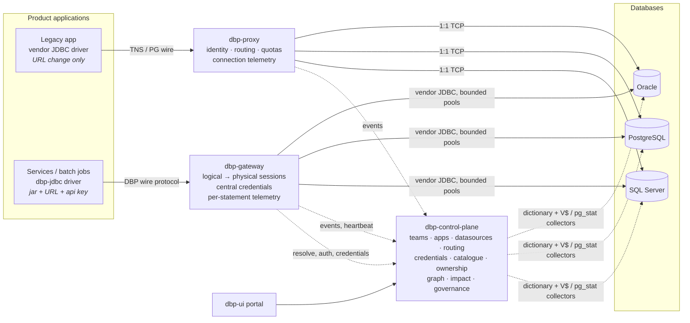

# Database Access Platform

[](https://github.com/r-thirumaran/database-platform/actions/workflows/build.yml)
 

An open-source platform that puts a **control plane, a connection gateway and a data-ownership graph**
between your applications and your databases (Oracle, PostgreSQL, SQL Server), so that dozens of
independently scaling services stop multiplying database sessions, credentials are rotated in one
place, and everyone can see **who owns, produces and consumes which table** — down to the PL/SQL
package, sub-function and trigger that touches it.

> Applications should know the *logical* data source they need, not the physical database behind it.



## Why

Decomposing a long-lived application into 30+ services and 50+ UI services means
**services × instances × pool size** physical connections. For Oracle this quickly becomes session
exhaustion, shared passwords sprayed over deployments, lockouts after rotation, and nobody knowing
which service reads which table — right when Oracle and PostgreSQL must coexist during a migration.

| Question                                                        | Answered by                                                           |
|-----------------------------------------------------------------|-----------------------------------------------------------------------|
| How many Oracle sessions do we really use, and who opens them?  | proxy connection telemetry + collectors (`V$SESSION`)                 |
| Can 500 application connections become 60 database sessions?    | gateway pools + drop-in JDBC driver                                   |
| Can we rotate a database password without redeploying 30 services? | central credentials, versioned, drained by the gateway            |
| Which service generated this query, and which tables did it touch? | per-statement telemetry with SQL analysis                          |
| Who owns `SALES.CUSTOMER`? Who writes it? Who reads it?         | metadata plane: ownership, producers, consumers                       |
| What breaks if I change `CUSTOMER.EMAIL`?                       | impact analysis over relationships, PL/SQL dependencies and triggers  |
| Can `sales` move from Oracle to PostgreSQL without touching consumers? | logical datasources + routing rules + migration switch         |
| Is team B querying team A's tables directly?                    | governance policies and violations                                    |

## The honest part about Oracle

Oracle's wire protocol cannot be pooled by a pass-through proxy the way PgBouncer pools PostgreSQL
(proprietary TNS/TTC protocol, O5LOGON challenge-response authentication, sticky session state).
The platform therefore offers two complementary paths — the full analysis, including Oracle's own
DRCP and Connection Manager Traffic Director Mode, is in
[docs/oracle-connection-analysis.md](docs/oracle-connection-analysis.md):

| Path                                             | Application change                                                         | What you get                                                                                                                           |
|--------------------------------------------------|----------------------------------------------------------------------------|----------------------------------------------------------------------------------------------------------------------------------------|
| **Proxy** (`dbp-proxy`)                          | connection URL only, vendor driver unchanged                               | application identity, logical routing, quotas, connection telemetry, SQL attribution via collectors. Oracle session count unchanged.    |
| **Gateway + driver** (`dbp-gateway`, `dbp-jdbc`) | swap the driver jar, change URL and password (api key); business code unchanged | many logical → few physical sessions, central credentials, exact per-statement telemetry, routing for migration. PL/SQL packages, functions, OUT parameters, ref cursors and triggers keep working. |
| Oracle DRCP / Connection Manager TDM             | URL only (vendor features)                                                 | fewer server processes/sessions with the stock driver; needs DBA enablement and a licence check                                       |

## What is in the box

| Module                 | Role                                                                                                              | Tech                              |
|------------------------|-------------------------------------------------------------------------------------------------------------------|-----------------------------------|
| `dbp-proxy/`           | Transparent protocol-aware TCP proxy: Oracle TNS connect-descriptor parsing and rewriting, PostgreSQL startup rewriting, SQL Server pass-through, identity (service alias, program, machine, CIDR), quotas, REDIRECT/RESEND handling, connection events, hot reload | Java 21, virtual threads |
| `dbp-jdbc/`            | Drop-in JDBC 4.3 driver `jdbc:dbp://gateway:7420/<datasource>`; zero dependencies; one shaded jar               | Java 21                           |
| `dbp-protocol/`        | Wire protocol codec shared by driver and gateway ([spec](docs/wire-protocol.md))                                  | Java 21, no deps                  |
| `dbp-gateway/`         | Connection gateway: HikariCP pool per physical database and credential version, transaction/session pinning, statements, batches, callable statements with OUT and cursor parameters, metadata, telemetry, TLS, Prometheus | Java 21, HikariCP |
| `dbp-common/`          | Telemetry models, control-plane client, SQL analyser (JSqlParser + regex fallback)                                | Java 21, Jackson                  |
| `dbp-control-plane/`   | REST API ([contract](docs/control-plane-api.md)), metadata store, collectors (Oracle, PostgreSQL, SQL Server), graph, impact analysis, governance, telemetry sink, UI host | Spring Boot 3, PostgreSQL (H2 for dev) |
| `dbp-ui/`              | Portal: dashboard, databases, datasources with migration switch, applications and api keys, teams, tables and ownership, routines, graph explorer, impact analysis, connections, queries, governance, admin | React, TypeScript, Vite, Cytoscape |
| `dbp-examples/`        | `orders-service` (same code in direct / proxy / gateway modes), `reporting-batch` (load and benchmark tool), `legacy-reporting` | Spring Boot / Java 21 |
| `dbp-integration-tests/` | End-to-end suite running the real jars against PostgreSQL ([report](docs/validation-report.md))                | JUnit 5, failsafe                 |
| `demo/`                | Retail demo schema: Oracle PL/SQL package, functions, ref-cursor procedure, triggers; PostgreSQL and SQL Server equivalents | SQL |
| `deploy/`              | Docker compose (Oracle Free 23, PostgreSQL 17, platform, examples, Prometheus, Grafana), Kubernetes manifests, Helm chart | YAML |
| `docs/`                | Architecture, specifications, rollout, operations, security, collectors, migration playbook, compatibility, FAQ, ADRs ([index](docs/README.md)) | Markdown |

## Quick start (Docker)

Prerequisites: Docker with about 6 GB RAM available (Oracle Database Free needs 2 GB or more).

```bash
cd deploy
cp .env.example .env                       # set ORACLE_PASSWORD, DBP_MASTER_KEY, DBP_SERVICE_TOKEN
docker compose --profile core --profile examples --profile monitoring up -d --build
```

| URL                           | What                                                                 |
|-------------------------------|----------------------------------------------------------------------|
| http://localhost:8080          | Portal and REST API (`/swagger-ui.html`, `/actuator/health`)         |
| http://localhost:3000          | Grafana (admin / admin), dashboard "DBP overview"                    |
| http://localhost:9090          | Prometheus                                                            |
| localhost:7420 / :7421         | Gateway wire protocol / admin (`/health`, `/metrics`, `/sessions`, `/pools`) |
| localhost:1521 / :5432 / :7431 | Proxy Oracle listener / PostgreSQL listener / admin                  |
| localhost:8091 / 8092 / 8093   | `orders-service` direct / through the proxy / through the gateway    |

Generate traffic and look at the result:

```bash
curl -X POST localhost:8093/orders -H 'content-type: application/json' \
     -d '{"customerId":1,"productId":1,"quantity":2}'      # through the gateway (PL/SQL package call)
curl localhost:8092/orders                                 # through the proxy (URL change only)
docker compose --profile batch run --rm reporting-batch    # 20 logical connections → few physical
```

Then open **Tables → SALES.ORDERS**: `orders-service` writes it *via `ORDER_PKG.PLACE_ORDER`*, and
`AUDIT_LOG` and `INVENTORY` are written *via trigger*. Try **Impact analysis** on `CUSTOMER.EMAIL`
and the **Graph** explorer. Oracle takes three to five minutes to initialise on first start;
[deploy/README.md](deploy/README.md) has the details and troubleshooting.

## Quick start (from source, no Docker)

```bash
mvn -q -DskipTests package                              # all Java modules
(cd dbp-ui && npm ci && npm run build)                   # UI, bundled into the control-plane jar when present
java -jar dbp-control-plane/target/dbp-control-plane.jar               # :8080, embedded H2 store, demo seed
java -jar dbp-gateway/target/dbp-gateway-*-all.jar                     # :7420, static YAML or control-plane mode
java -jar dbp-proxy/target/dbp-proxy-*-all.jar                         # :1521 / :5432 listeners
mvn -f dbp-integration-tests/pom.xml verify              # end-to-end suite against a local PostgreSQL
```

Configuration lives in three places, in the order you will probably adopt them: environment variables
and a static YAML file (gateway/proxy standalone), the control plane with its embedded H2 store, then
the control plane on your own PostgreSQL (`DBP_DB_URL`, `--spring.profiles.active=postgres`). See
[docs/operations.md](docs/operations.md).

## Using the drop-in driver

```properties
# before
spring.datasource.driver-class-name=oracle.jdbc.OracleDriver
spring.datasource.url=jdbc:oracle:thin:@//oracle-host:1521/FREEPDB1
spring.datasource.username=SALES_APP
spring.datasource.password=********

# after — business code unchanged
spring.datasource.driver-class-name=org.dbplatform.jdbc.DbpDriver
spring.datasource.url=jdbc:dbp://gateway:7420/sales
spring.datasource.username=orders-service
spring.datasource.password=${DBP_API_KEY}        # application api key issued by the control plane
```

Using only the proxy (no driver change, Oracle example):

```properties
spring.datasource.url=jdbc:oracle:thin:@//proxy-host:1521/sales.orders-service
spring.datasource.hikari.data-source-properties.v$session.program=orders-service
```

Supported and unsupported JDBC features: [docs/compatibility.md](docs/compatibility.md).

## How relationships are discovered

Nobody documents table dependencies by hand:

1. **Gateway telemetry** — every statement is analysed: tables (READ/WRITE), routines called,
   normalised SQL and hash, duration, rows, errors. Exact attribution to the application.
2. **Data dictionary crawlers** — `DBA_DEPENDENCIES`, `DBA_TRIGGERS`, foreign keys, view definitions
   (Oracle); `pg_class`, `pg_proc`, `pg_trigger`, constraints (PostgreSQL);
   `sys.sql_expression_dependencies` (SQL Server). *"orders-service CALLS ORDER_PKG.PLACE_ORDER"*
   becomes *"orders-service WRITES ORDERS, ORDER_ITEM, INVENTORY (via RESERVE_STOCK) and AUDIT_LOG
   (via trigger)"*.
3. **Runtime collectors** — `V$SESSION`/`V$SQL`/`V$SQL_PLAN`, `pg_stat_activity`, DMVs, joined to
   proxy connections through the proxy's outbound port (`V$SESSION.PORT`,
   `pg_stat_activity.client_port`), or to applications through program names, host patterns and
   CIDRs. Optional Oracle unified audit for exact attribution of legacy apps. No licensed Oracle
   views (ASH/AWR) are used.
4. **Humans** — declare ownership, producers and intended consumers; confirm or reject what the
   platform inferred. Governance policies compare the two.

## Traceability and performance

* Every query event carries application, session, datasource, database, SQL hash, tables, routines,
  duration, rows, error state and the `clientInfo` map. The driver forwards
  `Connection.setClientInfo(name, value)` to the gateway, so an application can pass its trace id
  (for example `traceparent`) per request and correlate database statements with distributed traces
  ([docs/operations.md](docs/operations.md#request-level-tracing)). OpenTelemetry export is on the roadmap.
* The gateway adds one network hop. Java 21 virtual threads, streamed result sets with server-side
  cursors, prepared statement reuse while pinned, cached SQL analysis (about 1 µs cached) and fully
  asynchronous, bounded telemetry keep the data path lean. `reporting-batch` is the benchmark tool:
  the same jar runs direct, through the proxy and through the gateway and prints statements per
  second with p50/p95/p99. Measured in this repository's validation (PostgreSQL, 4 shared cores):
  20 logical connections over 4 physical connections, about 940 statements/s with zero errors.

## Where each component can run

| Component                 | Protocol      | Runs on                                                                                       |
|---------------------------|---------------|-----------------------------------------------------------------------------------------------|
| control plane + UI        | HTTP          | anything, including Cloud Run and other HTTP-only CaaS                                         |
| gateway                   | raw TCP 7420  | Kubernetes, VMs, ECS/Fargate behind a network load balancer, Azure Container Apps TCP ingress — **not** Cloud Run (HTTP-only ingress). Applications on Cloud Run reach it over the VPC connector. |
| proxy                     | raw TCP 1521/5432/1433 | same as the gateway                                                                   |

## Validation status

Full report with environment, per-test evidence and defect list: [docs/validation-report.md](docs/validation-report.md).

| Layer                                   | How it was tested                                                                                      | Result |
|-----------------------------------------|--------------------------------------------------------------------------------------------------------|--------|
| Wire protocol codec                     | 261 round-trip unit tests                                                                              | pass   |
| Common library (SQL analyser, clients)  | 217 unit tests incl. 118 SQL statements across Oracle / PostgreSQL / SQL Server dialects               | pass   |
| JDBC driver                             | 70 tests against a scriptable fake gateway; real-driver round trips (below)                            | pass   |
| Gateway                                 | 70 tests on H2 (incl. Oracle mode) and embedded PostgreSQL: pinning rules, 50 logical sessions on a 5-connection pool, callable OUT and ref-cursor parameters, rotation, TLS, plus 21 real-driver round-trip tests (value matrix, time zones, metadata, errors) | pass |
| Proxy                                   | 64 tests: synthetic TNS packets (inline/deferred connect strings, REDIRECT, RESEND, REFUSE), real PostgreSQL end to end through the proxy incl. `pg_stat_activity.client_port` correlation and quota refusals | pass |
| Control plane                           | Spring Boot test suite (REST contract, telemetry ingestion, CALL expansion, graph, impact, governance, import/export, Flyway on embedded PostgreSQL) | pass |
| UI                                      | lint, type check, unit tests, Playwright walkthrough of every page and mutation against the **real** control plane (18/18) and the mock (18/18) | pass |
| End to end (real jars, PostgreSQL 16)   | 41 scenario tests: bootstrap import, gateway in control-plane mode, driver over the full stack, HikariCP with physical connections capped at 4, batch load, telemetry round trip with CALL expansion, credential rotation, routing rule and switch, access control, proxy path | 41/41 pass (9 recorded deviations, see below) |
| CI (GitHub Actions)                     | `mvn verify` for all modules, UI build, Docker image builds for control plane, gateway, proxy. The last run that GitHub executed for this branch (19:14 UTC, run 19) passed every module except a control-plane test fixed since; later runs on the feature branch were not scheduled (no runner assigned within seconds), which usually means the account's Actions minutes or spending limit — check *Settings → Billing → Actions*, then trigger the workflow manually (`workflow_dispatch`) or open a pull request. | see badge |

### Deviations and untested paths — read before relying on this

Found during validation and either fixed or still open at the time of writing (the report lists each with file and fix):

* **Oracle and SQL Server were not executed in the build environment** (no Docker daemon). The TNS
  proxy handling, the Oracle collectors (`DBA_*`, `V$SESSION`, `V$SQL_PLAN`, unified audit) and the
  SQL Server collectors are validated with synthetic packets and stub result sets only. The docker
  compose stack with Oracle Database Free 23 is the way to verify them; the specific assumptions to
  check are listed at the end of [docs/oracle-connection-analysis.md](docs/oracle-connection-analysis.md).
* **Docker images, compose, Kubernetes and Helm** were validated structurally (YAML/JSON parsing,
  path and name consistency) but not run here; the GitHub Actions `docker` job builds the three
  platform images on every push.
* **PostgreSQL dictionary crawler** read privilege-filtered `information_schema` views, so a
  `pg_monitor`-only collector role catalogued almost nothing; **runtime sampler** failed when
  `pg_stat_statements` lived outside the connection's `search_path`; the **proxy could not start in
  control-plane mode** because the identity rules were emitted under two spellings; the **control
  plane could not model H2**. All four are being fixed in the control plane (see the report for status).
* **Gateway read-only grants** were not enforced for autocommit statements on PostgreSQL, and a
  **failed first statement of a transaction** did not pin the session (PostgreSQL would report
  `25P02`). Both are being fixed in the gateway.
* **Not supported in the POC**: scrollable or updatable result sets, streaming LOBs beyond the
  frame limit, PostgreSQL large objects (`oid`), named callable parameters, vendor-specific
  `unwrap`, XA, per-element update counts on a failed batch, TLS between proxy and clients.
* **Security posture is POC level**: UI/API auth is none or basic; api keys and a shared service
  token protect the platform endpoints; the gateway admin endpoints are unauthenticated (bind them
  to an internal interface). See [docs/security.md](docs/security.md).

## Rollout

Phase 0 observe (proxy + collectors) → Phase 1 gateway foundation → Phase 2 driver adoption →
Phase 3 metadata and ownership → Phase 4 graph and impact in change management → Phase 5 multi-engine
routing → Phase 6 controlled migration → Phase 7 domain APIs. Details in
[docs/rollout.md](docs/rollout.md); the Oracle → PostgreSQL runbook is in
[docs/migration-playbook.md](docs/migration-playbook.md).

## Documentation

[docs/README.md](docs/README.md) indexes everything: architecture, Oracle connection analysis,
wire protocol, control-plane API, telemetry events, metadata model, collectors, operations,
security, compatibility, FAQ, glossary and the architecture decision records.

## Licence

Apache License 2.0. The project is vendor-neutral and company-neutral; the demo domain is generic
retail.
