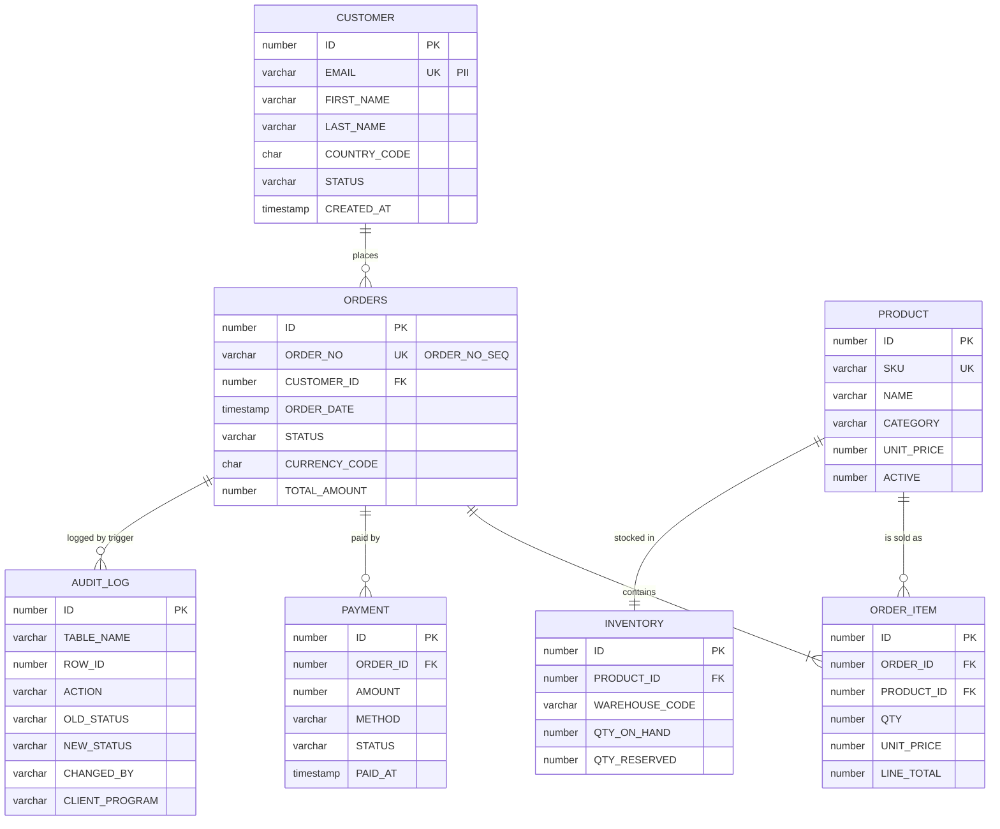
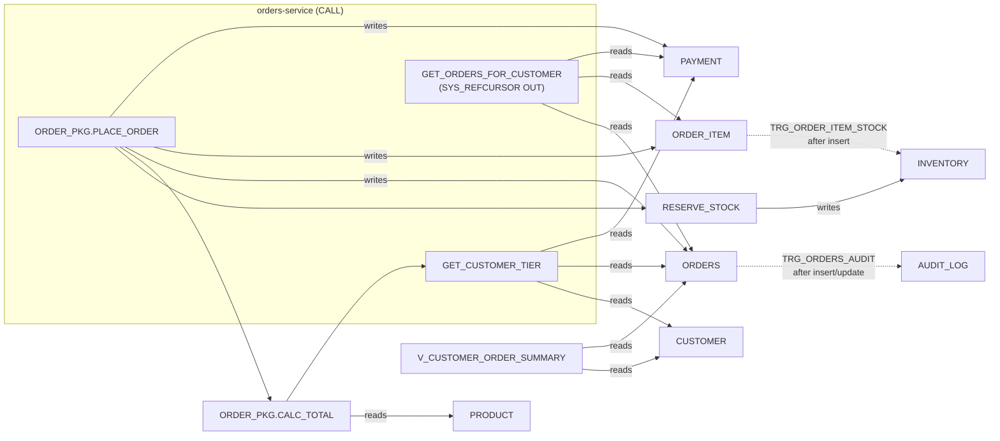

# Demo schemas

A small, generic **retail** domain that the examples, the collectors and the UI all work against. It
exists for Oracle (primary, `demo/sql/oracle`), PostgreSQL (`demo/sql/postgres`, the migration target
of the `sales` datasource) and SQL Server (`demo/sql/mssql`, schema only, not wired into compose).

No company, product or vendor-internal names: customers are `customer0001@example.org`, products are
`SKU-00001`, teams in the platform configuration are `sales-platform` and `finance-analytics`.

## Domain

| Table        | Rows (demo) | What |
|--------------|-------------|------|
| `CUSTOMER`   | 200   | accounts; `EMAIL` is PII, `STATUS` ACTIVE/BLOCKED/CLOSED |
| `PRODUCT`    | 60    | catalogue with `UNIT_PRICE`, `CATEGORY`, `ACTIVE` flag |
| `INVENTORY`  | 60    | one row per product and warehouse (`MAIN`), `QTY_ON_HAND` / `QTY_RESERVED` |
| `ORDERS`     | ~610  | order header, `STATUS` NEW/PAID/SHIPPED/DELIVERED/CANCELLED, `TOTAL_AMOUNT` |
| `ORDER_ITEM` | ~1200 | order lines, unique per (order, product) |
| `PAYMENT`    | ~620  | PENDING/CAPTURED/REFUNDED/FAILED, `PAID_AT` |
| `AUDIT_LOG`  | ~620+ | written only by trigger `TRG_ORDERS_AUDIT`, records the client program of the session |
| `V_CUSTOMER_ORDER_SUMMARY` | view | per-customer order count and lifetime value |

## Routines and triggers (lineage the dictionary crawler discovers)

The PL/SQL API is deliberately layered so that a single `CALL` from an application fans out into
several tables. The control plane expands `app CALLS routine` into `app READS/WRITES table
(viaRoutine)` using `DBA_DEPENDENCIES` and `DBA_TRIGGERS` (see `docs/telemetry-events.md`,
derivation rules).

Expected result in the UI after the examples have run: `orders-service` shows **CALLS**
`ORDER_PKG.PLACE_ORDER` plus **WRITES** on `ORDERS`, `ORDER_ITEM`, `PAYMENT`, `INVENTORY`,
`AUDIT_LOG` with `viaRoutine` set, although its own SQL never names those tables.

| Oracle                                | PostgreSQL                                              |
|---------------------------------------|---------------------------------------------------------|
| `ORDER_PKG.PLACE_ORDER(c, p, q, OUT id)` | `CALL sales.order_pkg_place_order(c, p, q, INOUT id)` |
| `ORDER_PKG.CALC_TOTAL`                | `sales.calc_total`                                       |
| `ORDER_PKG.CANCEL_ORDER`              | `sales.order_pkg_cancel_order`                           |
| `RESERVE_STOCK`                       | `sales.reserve_stock` (procedure)                        |
| `GET_CUSTOMER_TIER` → VARCHAR2        | `sales.get_customer_tier` → varchar                      |
| `GET_ORDERS_FOR_CUSTOMER(id, OUT SYS_REFCURSOR)` | `sales.get_orders_for_customer(id)` → refcursor; `sales.get_orders_for_customer_rows(id)` → SETOF |
| `TRG_ORDERS_AUDIT`, `TRG_ORDER_ITEM_STOCK` | `trg_orders_audit`, `trg_order_item_stock` (SECURITY DEFINER functions) |

## What the demo exercises

* **Gateway telemetry**: plain SQL (`SELECT ... FETCH FIRST n ROWS ONLY`), a procedure with an
  OUT parameter, a function call with a return value, a ref-cursor OUT parameter, batches of
  `UPDATE` in a transaction (`reporting-batch`).
* **Routine lineage**: package → function → function chains, standalone procedure, two triggers.
* **View lineage**: `V_CUSTOMER_ORDER_SUMMARY`.
* **Foreign keys**: six FKs incl. `ON DELETE CASCADE`.
* **Proxy identity**: the same application account (`SALES_APP`) used by several applications,
  distinguished by service alias (`sales.orders-service`, `sales.legacy-reporting`) and
  `V$SESSION.PROGRAM`.
* **Collector**: dictionary crawl of schema `SALES` / `sales`, V$ and `pg_stat_activity`
  sampling, optional unified audit policy.
* **Migration**: identical logical model on Oracle and PostgreSQL, so the `sales` datasource can
  be switched to `sales-postgres` for one application at a time through a routing rule.
* **Governance**: `legacy-reporting` (team `finance-analytics`) reads tables owned by
  `sales-platform` through the proxy → cross-team access; `orders-service` in `direct` mode
  → `DIRECT_DB_ACCESS_BYPASSING_PLATFORM` once the collector sees its sessions.

## Accounts

| Oracle          | PostgreSQL      | Role |
|-----------------|-----------------|------|
| `SALES`         | `sales`         | schema owner, no runtime use |
| `SALES_APP`     | `sales_app`     | shared application account (gateway pools, direct and proxy examples) |
| `DBP_COLLECTOR` | `dbp_collector` | collector: dictionary, `V$`/`pg_stat_*`, audit trail |
| –               | `dbp`           | owner of the control-plane metadata database `dbp` |

Default passwords are in the scripts; `deploy/.env` overrides them for every component at once.
Details of the privileges and why they are needed: [`sql/oracle/README.md`](sql/oracle/README.md).

## Loading

* Docker: mounted automatically by `deploy/docker-compose.yml` (`/container-entrypoint-initdb.d`
  and `/docker-entrypoint-initdb.d`). Oracle needs 3–5 minutes on first start.
* Manually: run the scripts in order with `sqlplus / as sysdba` (Oracle) or
  `psql -U postgres -f` (PostgreSQL). Each file is idempotent only on a fresh database.
