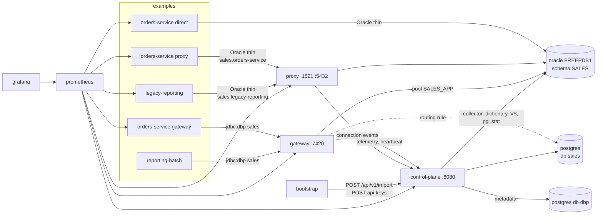

# Deployment

Everything needed to run the platform and the demo: Dockerfiles, a docker-compose stack with the
demo databases and example applications, Kubernetes manifests, a Helm chart and Prometheus/Grafana
configuration.

## Quick start (docker compose)

```bash
cd deploy
cp .env.example .env            # set ORACLE_PASSWORD (and change the other secrets if you like)
docker compose --profile core --profile examples up -d      # or: make up
docker compose --profile monitoring up -d                   # optional: Prometheus + Grafana
```

First start builds five images from source (Maven + npm inside Docker, a few minutes) and
initialises Oracle Database Free, which takes **3–5 minutes**. `docker compose ps` shows the health
of every service; `bootstrap` exits with `Exited (0)` once the control plane has been configured.

Then:

| URL | What |
|-----|------|
| http://localhost:8080 | control plane UI and API (`/api/v1`, `/swagger-ui.html`, `/actuator/health`) |
| http://localhost:8091 | orders-service **direct** (Oracle thin → `oracle:1521/FREEPDB1`) |
| http://localhost:8092 | orders-service **proxy** (Oracle thin → `proxy:1521/sales.orders-service`) |
| http://localhost:8093 | orders-service **gateway** (`jdbc:dbp://gateway:7420/sales`, API key from bootstrap) |
| http://localhost:8094 | legacy-reporting (Oracle thin → `proxy:1521/sales.legacy-reporting`) |
| http://localhost:7421/health, /metrics, /sessions, /pools | gateway admin (no authentication) |
| http://localhost:7431/health, /metrics | proxy admin (open) |
| http://localhost:7431/connections, /config | proxy admin — need `-H "X-DBP-Service-Token: $DBP_SERVICE_TOKEN"` (`dev-service-token` unless changed in `.env`), because compose sets `DBP_SERVICE_TOKEN` on the proxy |
| http://localhost:9090 | Prometheus (profile `monitoring`) |
| http://localhost:3000 | Grafana, dashboard "DBP overview" (profile `monitoring`, admin / `GRAFANA_ADMIN_PASSWORD`) |
| localhost:1521 / localhost:5432 | **proxy** listeners (Oracle / PostgreSQL protocol) |
| localhost:1522 / localhost:5433 | the demo databases themselves |

`make demo` starts the stack, waits for bootstrap and fires a few requests at every example so the UI
has something to show. `make help` lists all targets.

## What is in the stack



| Service | Profile | Image | Notes |
|---------|---------|-------|-------|
| `oracle` | core | `gvenzl/oracle-free:23-slim` | runs `demo/sql/oracle/*` on first start; host port 1522 |
| `postgres` | core | `postgres:17` | databases `dbp` (control-plane metadata) and `sales`; `pg_stat_statements` preloaded; host port 5433 |
| `control-plane` | core | built from `docker/Dockerfile.control-plane` | Spring profile `postgres`, serves the UI, resolves `ENV` credentials from its own environment |
| `gateway` | core | `docker/Dockerfile.gateway` | `DBP_GATEWAY_ID=gw-1`, ports 7420/7421 |
| `proxy` | core | `docker/Dockerfile.proxy` | `DBP_PROXY_ID=proxy-1`, owns host ports 1521 and 5432, admin 7431; `DBP_PROXY_STRICT_ALIASES` / `DBP_PROXY_UNKNOWN_APP_MAX_CONNECTIONS` from `.env` |
| `bootstrap` | core | `curlimages/curl` | one-shot: `bootstrap/bootstrap.sh` imports `bootstrap/platform-config.json`, creates API keys → `.generated/examples.env`, triggers dictionary crawls |
| `orders-service-{direct,proxy,gateway}` | examples | `dbp-examples/orders-service/Dockerfile` | same image, different `SPRING_PROFILES_ACTIVE`; ports 8091/8092/8093 |
| `legacy-reporting` | examples | `dbp-examples/legacy-reporting/Dockerfile` | port 8094 |
| `reporting-batch` | batch | `dbp-examples/reporting-batch/Dockerfile` | run on demand, exits with a summary |
| `prometheus`, `grafana` | monitoring | official images | config under `monitoring/` |

### Bootstrap and API keys

`bootstrap/platform-config.json` is the whole platform configuration as an import document (teams,
applications with identity rules, credentials with provider `ENV`, databases `sales-oracle` and
`sales-postgres`, datasources `sales`/`inventory`/`payments`, access grants, declared ownership and
relationships). `bootstrap.sh` POSTs it to `/api/v1/import`, which upserts by name, so it can be
re-run after edits (`docker compose --profile core run --rm bootstrap`).

API keys cannot be pre-provisioned through the import, so bootstrap creates one per example
application (`POST /api/v1/applications/{id}/api-keys`) and writes them to
`deploy/.generated/examples.env` (git-ignored). The gateway-mode containers mount that directory and
their entrypoint exports `DBP_API_KEY` from it. Re-generate with `DBP_BOOTSTRAP_FORCE=true`.

### Running the batch

```bash
make batch            # 20 logical connections for 60 s through the gateway
make batch-direct     # the same straight against Oracle: 20 real sessions
make batch-proxy      # through the proxy: 20 sessions, attributed to reporting-batch
BATCH_CONNECTIONS=50 BATCH_DURATION_SECONDS=120 make batch
```

While it runs, compare `GET /api/v1/stats/pools` (or Datasources → sales → Pools in the UI) with the
pool size (8) in `platform-config.json`: 20+ logical sessions, ≤ 8 physical connections.

### Looking at the results

1. **Overview**: components online (gw-1, proxy-1), connection counts by source.
2. **Applications** → each example: relationships with their source (`GATEWAY`,
   `PROXY_CORRELATION`, `COLLECTOR_SESSION`), calls to `ORDER_PKG.PLACE_ORDER`, indirect writes
   via routine and trigger.
3. **Graph**: team → application → table/routine; filter on `SALES.ORDERS`.
4. **Tables** → `SALES.ORDERS` → **Impact**: consumers, routines, triggers, views, risk score.
5. **Connections / live**: proxy connections with program and service alias, gateway sessions.
6. **Governance**: violations for the direct variant (`DIRECT_DB_ACCESS_BYPASSING_PLATFORM`) and
   for `legacy-reporting` reading `sales-platform` tables (`CROSS_TEAM_DIRECT_ACCESS` unless the
   declared relationships are confirmed).
7. **Datasources → sales → routing rules**: enable the disabled rule to send `orders-service`
   (gateway variant) to PostgreSQL; restart it with `BATCH_ENGINE=POSTGRES`
   (`DBP_DEMO_ENGINE`) and watch the same code run against the other engine.

## Images

| Dockerfile | Stages | Result |
|------------|--------|--------|
| `docker/Dockerfile.control-plane` | `node:22-alpine` builds `dbp-ui` → `maven:3.9-eclipse-temurin-21` copies `dist/` into `dbp-control-plane/src/main/resources/static` and runs `mvn -pl dbp-control-plane -am package` → `eclipse-temurin:21-jre` | `target/dbp-control-plane.jar` (pom `finalName`, no version suffix) serving API and UI; the build fails if `static/index.html` is not in the jar |
| `docker/Dockerfile.gateway` | Maven → JRE | `dbp-gateway-<ver>-all.jar` |
| `docker/Dockerfile.proxy` | Maven → JRE | `dbp-proxy-<ver>-all.jar` |
| `dbp-examples/*/Dockerfile` | Maven → JRE | example jars; `orders-service` and `reporting-batch` bundle `dbp-jdbc` |

All runtime images run as a non-root user (uid 10001), set `JAVA_TOOL_OPTIONS=-XX:MaxRAMPercentage=75`
(container-aware heap) and define a `HEALTHCHECK`. The build context is always the repository root;
a `.dockerignore` excluding `**/target`, `**/node_modules`, `.git` keeps the context small.

## Kubernetes

`k8s/` is a kustomize base: namespace `dbp`, ConfigMap, Secret template, Deployments and Services
for control plane / gateway / proxy, an HPA for the gateway, PodDisruptionBudgets and the
NetworkPolicies that make the platform the only way to the databases:

```bash
cp deploy/k8s/secret.example.yaml deploy/k8s/secret.yaml   # edit values
kubectl apply -k deploy/k8s
```

The databases are expected outside the cluster (or in their own manifests); set the database CIDR in
`k8s/networkpolicy.yaml`. Applications connect to `dbp-gateway.dbp.svc.cluster.local:7420` or
`dbp-proxy.dbp.svc.cluster.local:1521/5432`.

`helm/dbp/` is the same as a chart: `helm install dbp deploy/helm/dbp -n dbp --create-namespace
--set secrets.serviceToken=... --set networkPolicy.enabled=true --set 'networkPolicy.databaseCidrs={10.1.2.0/24}'`.

Probes: control plane `GET /actuator/health` (startup), `/actuator/health/readiness` and
`/actuator/health/liveness` (Spring probes are enabled); gateway `GET :7421/health` (startup/readiness)
and a TCP check on 7420 (liveness); proxy `GET :7431/health` and a TCP check on 1521. The proxy's
`/health` and `/metrics` never require the service token, so probes and Prometheus need no header.

### Where each component can run

| Component | Needs | Fits | Does not fit |
|-----------|-------|------|--------------|
| control plane + UI | HTTP 8080, a PostgreSQL, a network path to the databases (collectors) | any container platform: Kubernetes, VMs, ECS/Fargate, Azure Container Apps, **Cloud Run** (min instances 1, VPC connector / Direct VPC egress to the databases, Cloud SQL as metadata store) | – |
| gateway | raw TCP 7420 (+ HTTP 7421 for probes/metrics), long-running | Kubernetes Service, VMs, ECS/Fargate behind a **Network Load Balancer**, Azure Container Apps with **TCP ingress** | **Cloud Run** and other HTTP-only serverless platforms (no TCP ingress) |
| proxy | raw TCP 1521/5432/1433 (+ HTTP 7431) | same as the gateway | Cloud Run, HTTP-only platforms |
| applications with the driver | a TCP route to the gateway | anywhere — on **Cloud Run** they reach the gateway's internal address through the Serverless VPC Access connector | – |

Sizing (module READMEs): gateway and proxy 300–500 MB RAM each, 4 cores drive a few hundred logical
sessions (the physical pool is the bottleneck); control plane 600–900 MB plus PostgreSQL. The manifests
request 512 Mi / 0.5 CPU (gateway), 384 Mi / 0.25 CPU (proxy), 768 Mi / 0.25 CPU (control plane).
Full table in [`docs/operations.md`](../docs/operations.md#where-each-component-can-run).

## Monitoring

`monitoring/prometheus.yml` scrapes the control plane (`/actuator/prometheus`: Spring Boot defaults —
`http_server_requests_*`, `hikaricp_*`, `jvm_*`; no custom `dbp_*` meters in the POC), the gateway
(`:7421/metrics`: `dbp_gateway_logical_sessions`, `dbp_gateway_pinned_sessions`,
`dbp_gateway_pool_{active,idle,waiting,total,max}` by `datasource`, `dbp_gateway_statements_total`
by `datasource,operation,success`, `dbp_gateway_statement_duration_seconds` histogram,
`dbp_gateway_errors_total{sqlstate}`, `dbp_gateway_telemetry_dropped_total`), the proxy
(`:7431/metrics`: `dbp_proxy_connections_active{listener,application,datasource,backend}`,
`dbp_proxy_connections_live`, `dbp_proxy_connections_{accepted,refused,failed}_total`,
`dbp_proxy_bytes_{in,out}_bytes_total`, `dbp_proxy_backend_connect_seconds`,
`dbp_proxy_telemetry_events_dropped`) and the three `orders-service` variants (HikariCP metrics;
`legacy-reporting` has no Prometheus registry). Grafana is provisioned with the Prometheus datasource and
`monitoring/grafana/dashboards/dbp-overview.json` (connections through proxy and gateway, logical vs
physical, statements/s, latency, pools, client-side Hikari pools, control plane HTTP/JVM). The exact
names are listed in [`docs/operations.md`](../docs/operations.md#metrics-catalogue).

## Troubleshooting

* **Oracle is slow to start.** First start creates the database: 3–5 minutes on a laptop, longer on
  a small VM. `docker compose logs -f oracle` shows `DATABASE IS READY TO USE!` followed by the init
  scripts. Anything that depends on Oracle waits for its healthcheck. Oracle Free needs **≥ 2 GB RAM**
  for the container; give Docker Desktop 6–8 GB in total for the whole stack.
* **`ORACLE_PASSWORD` not set.** Compose refuses to start the `oracle` service; set it in `.env`.
* **Ports 1521/5432 already in use.** They belong to the proxy here. Either stop the local database or
  change `PROXY_ORACLE_HOST_PORT` / `PROXY_POSTGRES_HOST_PORT` in `.env` (and use those ports in
  your JDBC URLs).
* **Changed a demo SQL script but nothing happens.** Init scripts only run on an empty volume:
  `docker compose down -v` (destroys the demo data) and start again.
* **Changed a password in `.env` after the first start.** The database keeps the old one. Run
  `ALTER USER SALES_APP IDENTIFIED BY "..."` (Oracle) / `ALTER ROLE sales_app PASSWORD '...'`
  (PostgreSQL) or reset the volumes.
* **orders-service-gateway logs `no API key found`.** Bootstrap did not finish: `docker compose logs
  bootstrap`. Usually the control plane rejected the import (contract mismatch) — fix
  `bootstrap/platform-config.json` and re-run `docker compose --profile core run --rm bootstrap`.
* **Gateway returns `08004` to the examples.** API key unknown (keys were regenerated after the
  app started → restart the app) or no enabled access grant for the datasource.
* **`401` from `curl localhost:7431/connections`.** Expected: compose sets `DBP_SERVICE_TOKEN` on the
  proxy, so `/connections` and `/config` require `-H "X-DBP-Service-Token: $DBP_SERVICE_TOKEN"`.
  Live connections are also on the portal (Connections page) without a token.
* **`healthcheck`/`GET :7431/health` says `DEGRADED`.** A proxy listener could not bind (host port
  clash inside the container is impossible, but a misconfigured static file can be) or stopped
  accepting; it is re-bound on the next config poll. The body lists the listeners and their errors.
* **`healthcheck.sh` of Oracle stays unhealthy for a long time.** Normal during the first minutes;
  if it never turns healthy check memory (`docker stats`) and the Oracle log.
* **Build is slow.** Images build the full Maven reactor each time; the Dockerfiles use BuildKit
  cache mounts (`DOCKER_BUILDKIT=1`, default in recent Docker) so later builds reuse `~/.m2`.

## Resource needs

| Service | RAM (approx.) |
|---------|---------------|
| oracle (Free 23) | 2–2.5 GB |
| postgres | 150 MB |
| control-plane | 600–900 MB |
| gateway, proxy | 300–500 MB each |
| each example | 300–400 MB |
| prometheus + grafana | 400 MB |

Core + examples ≈ 6 GB; add 0.5 GB for monitoring.
