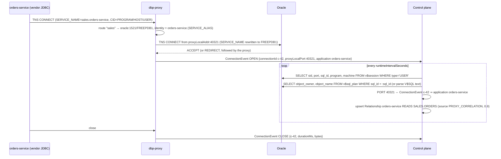
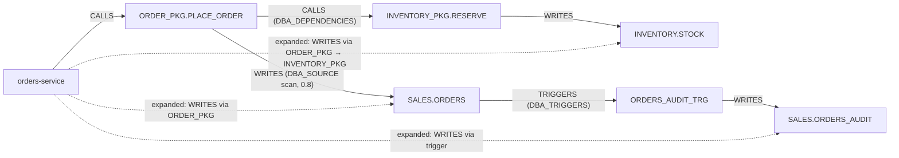

# Collectors

The control plane runs **collectors** against every registered physical database. They populate the
catalogue (tables, columns, routines), the static **dependencies** (object → object, from the data
dictionary) and part of the runtime **relationships** (application → object), and they provide the
session snapshot behind `GET /connections/live`.

Collectors are read-only, use only views that come with the base engine (see [Licence notes](#licence-notes)),
and run on the intervals configured per database (`Database.collector`). They complement, and never
replace, gateway telemetry: when an application uses the driver, the gateway already reports every
statement with confidence 1.0.

Switches: `collector.enabled` per database (**default `false`** — set it when registering the
database, as `deploy/bootstrap/platform-config.json` does) and the global `DBP_COLLECTOR_ENABLED`
(`true`). The scheduler ticks every `DBP_COLLECTOR_TICK_SECONDS` (5) and runs each database on its own
intervals; collector connections use `DBP_COLLECTOR_CONNECT_TIMEOUT_SECONDS` (10) and
`collector.credential` when set, else the database credential. `DBP_COLLECTOR_MAX_SQL_PER_SAMPLE` (200)
bounds the new statements fetched from `V$SQL` / `pg_stat_statements` per runtime sample. Trigger a run
with `POST /databases/{id}/collect {"what":"DICTIONARY|RUNTIME|AUDIT"}`; `GET /databases/{id}/collector-status`
shows the last runs and `lastError`.

Related: [telemetry-events.md](telemetry-events.md) (derivation rules and confidence),
[metadata-model.md](metadata-model.md), [security.md](security.md#least-privilege-for-collector-accounts).

## Collector kinds

| Kind         | Trigger                                              | Produces                                                                                   | Default interval     |
|--------------|------------------------------------------------------|--------------------------------------------------------------------------------------------|----------------------|
| `DICTIONARY` | `dictionaryIntervalSeconds` or `POST /databases/{id}/collect {"what":"DICTIONARY"}` | Tables, columns, routines (incl. triggers, views), `Dependency` rows (`source = DICTIONARY`), row-count estimates, `lastDdlAt` | 3600 s |
| `RUNTIME`    | `runtimeIntervalSeconds` or manual                    | Session snapshot; `COLLECTOR_SESSION` and `PROXY_CORRELATION` relationships; `DIRECT_DB_ACCESS_BYPASSING_PLATFORM` evidence | 15 s |
| `AUDIT`      | with `RUNTIME` when `collector.auditTrail = true`, or manual | `COLLECTOR_AUDIT` relationships from the engine's audit trail                        | same as runtime      |

`collector.schemas` restricts the crawl to a list of schemas; leave it empty to crawl everything the
account can see except the engine's own schemas.

## Oracle

### What is collected and from where

| Data                                   | Views (readable with `SELECT_CATALOG_ROLE` / `SELECT ANY DICTIONARY`)                                           | Kind       |
|----------------------------------------|------------------------------------------------------------------------------------------------------------------|------------|
| Tables, views, materialized views      | `DBA_TABLES` (`NUM_ROWS` as `rowCountEstimate`, from optimizer statistics), `DBA_VIEWS`, `DBA_MVIEWS`, `DBA_OBJECTS` (`LAST_DDL_TIME`, `STATUS`, `CREATED`) | DICTIONARY |
| Columns                                | `DBA_TAB_COLUMNS` (`DATA_TYPE`, `DATA_LENGTH`, `DATA_PRECISION`, `DATA_SCALE`, `NULLABLE`, `DATA_DEFAULT`), `DBA_TAB_COMMENTS`, `DBA_COL_COMMENTS` | DICTIONARY |
| Routines                               | `DBA_OBJECTS` (`PROCEDURE`, `FUNCTION`, `PACKAGE`, `PACKAGE BODY`, `TRIGGER`), `DBA_PROCEDURES` (package members → `PKG.PROC` names) | DICTIONARY |
| Triggers                               | `DBA_TRIGGERS` (`TABLE_OWNER`, `TABLE_NAME`, `TRIGGERING_EVENT`, `TRIGGER_TYPE`, `STATUS`) → `Routine.kind = TRIGGER`, `triggerTableId`, `triggerEvent`, `Dependency T TRIGGERS G` | DICTIONARY |
| Foreign keys                           | `DBA_CONSTRAINTS` (`CONSTRAINT_TYPE = 'R'`) self-joined on `R_OWNER`/`R_CONSTRAINT_NAME` to the referenced table → `Dependency T1 FOREIGN_KEY T2` (table level; columns are not recorded) | DICTIONARY |
| Static dependencies                    | `DBA_DEPENDENCIES` (routine/view/trigger → table/routine) → `Dependency R REFERENCES T` / `R CALLS R2`         | DICTIONARY |
| READ/WRITE refinement                  | `DBA_SOURCE` (package bodies, procedures, triggers) scanned by the SQL analyser → `REFERENCES` upgraded to `READS`/`WRITES` with confidence 0.8 | DICTIONARY |
| Sessions                               | `V$SESSION` (`SID`, `SERIAL#`, `USERNAME`, `STATUS`, `PROGRAM`, `MACHINE`, `OSUSER`, `MODULE`, `ACTION`, `CLIENT_IDENTIFIER`, `PORT`, `SERVICE_NAME`, `LOGON_TIME`, `SQL_ID`, `PREV_SQL_ID`, `SQL_EXEC_START`, `TYPE = 'USER'`) | RUNTIME |
| SQL text and touched objects           | `V$SQL` (`SQL_ID`, `SQL_FULLTEXT`, `EXECUTIONS`, `ELAPSED_TIME`, `PARSING_SCHEMA_NAME`), `V$SQL_PLAN` (`OBJECT_OWNER`, `OBJECT_NAME`, `OBJECT_TYPE`, `OPERATION`) | RUNTIME |
| Audit trail (optional)                 | `UNIFIED_AUDIT_TRAIL` (`EVENT_TIMESTAMP`, `DBUSERNAME`, `CLIENT_PROGRAM_NAME`, `USERHOST`, `OS_USERNAME`, `ACTION_NAME`, `OBJECT_SCHEMA`, `OBJECT_NAME`, `SQL_TEXT`, `SESSIONID`), read incrementally by `EVENT_TIMESTAMP`, at most `DBP_COLLECTOR_MAX_SQL_PER_SAMPLE` rows per run | AUDIT |

`DBA_*` versus `ALL_*`: the collector account has no object privileges on application tables, so the
`ALL_*` views would show it almost nothing. `SELECT_CATALOG_ROLE`/`SELECT ANY DICTIONARY` make the
`DBA_*` views readable without granting access to table data, which is why the collector uses them.
When a `DBA_*` view is not readable (`ORA-00942`) the crawler falls back to the matching `ALL_*` view,
which only shows objects the account has privileges on — fine if the collector runs as the schema owner
itself (not recommended), nearly empty otherwise. Database session limits (`V$RESOURCE_LIMIT`) are not
collected; they remain a DBA-side check ([operations.md](operations.md#capacity-planning)).

### Privileges

`CREATE SESSION` + `SELECT_CATALOG_ROLE` (or `SELECT ANY DICTIONARY`); `AUDIT_VIEWER` only for the
`AUDIT` kind. Exact statements in [security.md](security.md#least-privilege-for-collector-accounts).
In a multitenant database, create the user inside the PDB that is registered as the `Database`.

### Interval guidance

| Setting                      | Guidance                                                                                                               |
|------------------------------|------------------------------------------------------------------------------------------------------------------------|
| `dictionaryIntervalSeconds`  | 3600 for most estates; the crawl is cheap on dictionary views but `DBA_SOURCE` scanning of large package bodies takes time; run it off-peak and after deployments (`POST …/collect`) |
| `runtimeIntervalSeconds`     | 10–30 (default 15). Each run is one `V$SESSION` query plus `V$SQL`/`V$SQL_PLAN` lookups for at most `DBP_COLLECTOR_MAX_SQL_PER_SAMPLE` new `SQL_ID`s; the cost is independent of application load. Below the scheduler tick (`DBP_COLLECTOR_TICK_SECONDS`, 5 s) it cannot run more often, and `V$SESSION.SQL_ID` already changes faster than any sampler can follow |
| Audit                        | Reads only rows newer than the last watermark (`EVENT_TIMESTAMP`); make sure the unified audit trail is purged by the DBA (`DBMS_AUDIT_MGMT`) so it does not grow unbounded |

### Licence notes

* `V$SESSION`, `V$SQL`, `V$SQL_PLAN`, the `DBA_*` dictionary views and `UNIFIED_AUDIT_TRAIL` are part of
  every Oracle Database edition and need **no extra option or pack**.
* **Deliberately not used**: `V$ACTIVE_SESSION_HISTORY` (ASH), `DBA_HIST_*` (AWR), `DBA_HIST_ACTIVE_SESS_HISTORY`,
  and the `DBMS_WORKLOAD_REPOSITORY` APIs. They require the Diagnostics Pack (an Enterprise Edition
  option) and querying them can count as use of the pack. The platform's sampling of `V$SESSION` is a
  poor man's ASH that stays within base-edition features; see [Limitations of sampling](#limitations-of-sampling).
* Unified auditing is a base feature, but the policies that generate rows are created by a DBA
  (`CREATE AUDIT POLICY … ACTIONS SELECT, INSERT, UPDATE, DELETE ON SALES.ORDERS; AUDIT POLICY …`).
  Audit volume on hot tables can be significant; scope the policies to the schemas under study.
* Statements such as "requires licence X" in this document are guidance; **check your own licence
  terms** with your vendor representative.

## PostgreSQL

### What is collected and from where

| Data                              | Catalog / view                                                                                                        | Kind       |
|-----------------------------------|-----------------------------------------------------------------------------------------------------------------------|------------|
| Tables, views, materialized views | `information_schema.tables` (base tables and views), `pg_matviews` (definition), `pg_class` + `pg_namespace` (`reltuples` as the row estimate, `relkind`), `pg_description` (comments) | DICTIONARY |
| Row estimates / activity          | `pg_stat_user_tables` (`n_live_tup`, `last_autoanalyze`)                                                                | DICTIONARY |
| Columns                           | `information_schema.columns` (`data_type`, `character_maximum_length`, `numeric_precision/scale`, `is_nullable`, `column_default`), `pg_attribute` + `pg_description` for column comments | DICTIONARY |
| Routines                          | `pg_proc` (`prokind` f/p, `prosrc`, argument names/types), `pg_language`                                                | DICTIONARY |
| Triggers                          | `pg_trigger` (`tgrelid`, `tgfoid`, `tgtype` → event), excluding internal constraint triggers                           | DICTIONARY |
| Foreign keys                      | `pg_constraint` (`contype = 'f'`, `conrelid`, `confrelid`)                                                             | DICTIONARY |
| View dependencies                 | `pg_views.definition` / `pg_matviews.definition` parsed by the SQL analyser → view `REFERENCES`/`READS` base tables  | DICTIONARY |
| Routine → table dependencies      | **Not tracked by the engine** for function bodies: derived by scanning `prosrc` with the SQL analyser (confidence 0.8) | DICTIONARY |
| Sessions                          | `pg_stat_activity` (`pid`, `datname`, `usename`, `application_name`, `client_addr`, `client_port`, `backend_start`, `state`, `query`, `query_start`; `backend_type = 'client backend'`, the collector's own `pg_backend_pid()` excluded) | RUNTIME |
| Statement statistics (optional)   | `pg_stat_statements` (`queryid`, `query`, `calls`, `total_exec_time`, `rows`) when `pg_extension` shows it installed      | RUNTIME    |

Attribution on PostgreSQL relies on `pg_stat_activity.application_name` (identity rule
`pgApplicationNames`), `client_addr` (CIDR) and `client_port` (proxy correlation). `pg_stat_statements`
aggregates per `(userid, dbid, queryid)` and carries no session or application dimension, so it is used
for hot-query statistics, not for relationships.

### Privileges

`pg_monitor` role (`pg_read_all_stats` is the part that matters: without it `pg_stat_activity.query` is
hidden for other users' sessions). `pg_stat_statements` requires the extension to be created in the
database and loaded via `shared_preload_libraries`; `max_connections` is not read (DBA-side check).

### Interval guidance

Same as Oracle. `pg_stat_activity` snapshots are cheap; `pg_stat_statements` is read incrementally
(`DBP_COLLECTOR_MAX_SQL_PER_SAMPLE` new statements per run).

### Licence notes

PostgreSQL has no licensed options; `pg_stat_statements` is a contrib extension shipped with the
server. Managed services may restrict `shared_preload_libraries` changes.

## SQL Server

### What is collected and from where

| Data                       | Views / DMVs                                                                                                                     | Kind       |
|----------------------------|----------------------------------------------------------------------------------------------------------------------------------|------------|
| Tables, views              | `sys.tables`, `sys.views`, `sys.schemas`, `sys.objects` (`modify_date` → `lastDdlAt`)                                            | DICTIONARY |
| Row estimates              | `sys.partitions` (`rows` for index_id 0/1)                                                                                       | DICTIONARY |
| Columns                    | `sys.columns`, `sys.types`, `sys.default_constraints`                                                                            | DICTIONARY |
| Routines                   | `sys.procedures`, `sys.objects` (`type IN ('FN','IF','TF','P','TR')`), `sys.sql_modules.definition` (needs `VIEW DEFINITION`)    | DICTIONARY |
| Triggers                   | `sys.triggers` (`parent_id`, `is_disabled`), `sys.trigger_events`                                                                 | DICTIONARY |
| Foreign keys               | `sys.foreign_keys` (`parent_object_id` → `referenced_object_id`, table level)                                                     | DICTIONARY |
| Static dependencies        | `sys.sql_expression_dependencies` (`referencing_id` → `referenced_id`), refined by scanning `sys.sql_modules.definition`         | DICTIONARY |
| Sessions                   | `sys.dm_exec_sessions` (`session_id`, `login_name`, `host_name`, `program_name`, `client_interface_name`, `status`, `login_time`), `sys.dm_exec_connections` (`client_net_address`, `client_tcp_port`), `sys.dm_exec_requests` (`sql_handle`, `statement_start_offset`) | RUNTIME |
| SQL text                   | `sys.dm_exec_sql_text(sql_handle)`; table references come from the SQL analyser (no plan XML is read)                           | RUNTIME |

Table and column comments (`sys.extended_properties`) and query statistics (`sys.dm_exec_query_stats`)
are not collected in the POC.

### Privileges

`VIEW SERVER STATE` (server level) and `VIEW DEFINITION` in each collected database. `VIEW ANY
DEFINITION` at server level is an alternative when many databases are collected. Recent versions
introduce finer permissions (`VIEW SERVER PERFORMANCE STATE`, `VIEW SERVER SECURITY STATE`); verify
which one your release requires for `sys.dm_exec_*`.

### Licence notes

The DMVs and catalog views used are available in all editions. Query Store is not used.

## Attribution: precedence and confidence

A runtime observation becomes a `Relationship` only when it can be attributed to an application. The
sources, in order of precedence when several apply to the same observation:

| Precedence | Source                | How the application is identified                                                                            | Confidence | Misses                                                        |
|-----------:|-----------------------|--------------------------------------------------------------------------------------------------------------|-----------:|---------------------------------------------------------------|
| 1          | `GATEWAY`             | Authenticated api key; every statement reported by the gateway                                               | 1.0        | Nothing (all statements)                                      |
| 2          | `COLLECTOR_AUDIT`     | Audit row's `CLIENT_PROGRAM_NAME` / `USERHOST` / `OS_USERNAME` matched against identity rules (`programNames` → `machinePatterns`; no port, so no proxy correlation); object and action are exact | 1.0 | Statements outside the audit policies; Oracle only in the POC |
| 3          | `PROXY_CORRELATION`   | `V$SESSION.PORT` (or `pg_stat_activity.client_port`, `sys.dm_exec_connections.client_tcp_port`) = `proxyLocalPort` of a live proxied connection to the same backend (from `ConnectionEvent`s and heartbeat snapshots); tables from `V$SQL_PLAN` when available, else the parsed SQL text of the sampled `SQL_ID` | 0.9 | Statements shorter than the sampling interval            |
| 4          | `COLLECTOR_SESSION`   | `V$SESSION.PROGRAM` / `MACHINE` / `OSUSER` / `MODULE` (or `application_name`, `program_name`, `client_addr`) matched against identity rules | 0.6 | Short statements; ambiguous rules (shared program names, wide CIDRs) |
| –          | `DECLARED`            | A human created it                                                                                            | 1.0        | –                                                             |

Identity-rule precedence inside a source follows the control plane contract: `serviceAliases` →
`pgApplicationNames` / `programNames` → `machinePatterns` → `cidrs`. A session that matches no rule
is reported with `identitySource = NONE` and produces no relationship (it is counted so you can see
the gap).

When the same (application, object, kind) is observed by several sources, one `Relationship` row per
source is kept; the UI and the impact report show the best confidence and the sum of counts.

### Limitations of sampling

* `V$SESSION` sampling at 15 s sees a session's *current* (or previous) `SQL_ID` only. A statement that
  completes between two samples is invisible; a long-running statement is over-represented in counts.
  `queryCount` for `COLLECTOR_SESSION` therefore means "samples in which the statement was observed",
  not executions.
* `V$SQL` is a cache: plans age out under memory pressure, so a sampled `SQL_ID` may have no text.
  The collector then records the relationship with the table set unknown and retries on the next sample.
* Oracle `PORT` and PostgreSQL `client_port` are per TCP connection; when the client is **not** behind the
  proxy (direct connection) there is no `ConnectionEvent` to join and only identity rules apply.
* Dictionary refinement of `REFERENCES` into `READS`/`WRITES` by scanning source is heuristic (dynamic
  SQL, `EXECUTE IMMEDIATE`, synonyms). Hence 0.8.
* Runtime samples only ever attach to **catalogued** tables: a sampled session never creates a
  placeholder table (gateway telemetry does, see below), so run a dictionary crawl before expecting
  `COLLECTOR_SESSION` / `PROXY_CORRELATION` relationships.
* Collectors see what the database shows them: a proxied connection has the proxy's address as
  `client_addr`, so CIDR rules must point at application subnets only for direct connections, and the
  `MACHINE`/`host_name` values (reported by the client itself) remain the better signal.

## Proxy correlation

The proxy does not parse SQL; it only knows which client opened which backend TCP connection. The
database knows what each connection executes but not which application it belongs to. The join key is
the proxy's **outbound source port**, which the database sees as the client port.

Details that matter:

* The join is `(backendHost, backendPort, proxyLocalPort)` ↔ `(V$SESSION.PORT)` within the lifetime
  `[openedAt, closedAt]` of the `ConnectionEvent`. Ports are reused after a connection closes, so the
  time window is part of the key.
* The proxy also forwards the client's `CID` block unchanged, so `V$SESSION.PROGRAM`, `MACHINE`
  and `OSUSER` still describe the real client; only `PORT` (and the listener's view of the peer address)
  belong to the proxy.
* For PostgreSQL the same join uses `pg_stat_activity.client_port`; for SQL Server
  `sys.dm_exec_connections.client_tcp_port`.
* Oracle connect-time **REDIRECT** (listener hands the client to another port/dispatcher) is followed
  by the proxy itself so that the backend connection always originates from the proxy; the
  `proxyLocalPort` reported is the one of the final backend socket.
* Correlation yields 0.9 rather than 1.0 because of sampling (not identity): identity is as good as the
  service alias or program rule that matched.

## Improving attribution without code changes

Most of the attribution gap in Phase 0 comes from generic program names (`JDBC Thin Client`) and shared
users. These are configuration-only fixes in the application's connection settings:

| Engine / driver                | Setting                                                                                                      | Shows up in                                     | Identity rule                 |
|--------------------------------|--------------------------------------------------------------------------------------------------------------|-------------------------------------------------|-------------------------------|
| Oracle thin JDBC               | connection property `v$session.program=orders-service` (also `v$session.machine`, `v$session.osuser`, `v$session.terminal`, `v$session.process`). Spring Boot/Hikari: `spring.datasource.hikari.data-source-properties.v$session.program=orders-service` | `V$SESSION.PROGRAM`, CID `PROGRAM` in the connect packet (so the proxy sees it too) | `programNames` |
| Oracle thin JDBC (12c+)        | `oracle.jdbc.OracleConnection.setClientInfo("OCSID.MODULE", …)` / `setEndToEndMetrics`, or `DBMS_APPLICATION_INFO.SET_MODULE` | `V$SESSION.MODULE/ACTION/CLIENT_IDENTIFIER`          | `programNames` (module is matched as a program name) |
| Oracle, any client             | Service alias in the connect string: `SERVICE_NAME=sales.orders-service` through the proxy                   | proxy `requestedService`                         | `serviceAliases` (exact, highest precedence) |
| PostgreSQL JDBC                | URL/property `ApplicationName=orders-service` (pgjdbc), or `application_name` in libpq-based clients; `Connection.setClientInfo("ApplicationName", …)` | `pg_stat_activity.application_name`, startup packet (proxy sees it) | `pgApplicationNames` |
| SQL Server JDBC                | `applicationName=orders-service` connection property                                                          | `sys.dm_exec_sessions.program_name` (LOGIN7 packet; hidden from the proxy when encrypted) | `programNames` |
| Any (through the gateway)      | `clientInfo.ApplicationName=…` in the `jdbc:dbp://` URL, or `Connection.setClientInfo` per request (`action`, `traceparent`, …; see [request-level tracing](operations.md#request-level-tracing)) | `QueryEvent.clientInfo`, forwarded to the physical session (Oracle `OCSID.MODULE/CLIENTID/ACTION`) | not needed: api key identifies the app |
| Kubernetes                     | One subnet/namespace CIDR per application tier                                                                | `client_addr`, listener peer address             | `cidrs` (last resort)         |

Rule of thumb: the closer the identity is set to the application (api key > service alias > program
name > machine pattern > CIDR), the more precise and the more stable it is across redeployments.

## PL/SQL lineage

Packages, functions and triggers are first-class in the catalogue because many tables are only touched
through them, and because they are the main cost of a migration.

1. **Static graph** — `DBA_DEPENDENCIES` gives `REFERENCES` edges (package body → table, package →
   package, trigger → table, view → table). Oracle tracks these for compiled PL/SQL, which makes them
   complete for static SQL. The equivalent on SQL Server is `sys.sql_expression_dependencies`; PostgreSQL
   has nothing comparable for function bodies, so step 2 is the only source there.
2. **READ/WRITE refinement** — the SQL analyser scans `DBA_SOURCE` (`sys.sql_modules`, `pg_proc.prosrc`)
   for `SELECT`/`INSERT`/`UPDATE`/`DELETE`/`MERGE` statements and the tables they name, turning
   `REFERENCES` into `READS`/`WRITES` (confidence 0.8). `EXECUTE IMMEDIATE` and `DBMS_SQL` strings are
   parsed when they are literals; otherwise the edge stays `REFERENCES`.
3. **Triggers** — `DBA_TRIGGERS` gives `T TRIGGERS G` with the event (`INSERT OR UPDATE`), and the
   trigger body is scanned like any routine, so a write to `ORDERS` expands to the tables the trigger
   writes.
4. **Expansion to applications** — when the gateway reports `CALL ORDER_PKG.PLACE_ORDER` by
   `orders-service`, the control plane stores `orders-service CALLS ORDER_PKG.PLACE_ORDER` and, for every
   table in the routine's transitive dependencies, `orders-service READS/WRITES T` with
   `viaRoutineId` set. A direct `INSERT INTO ORDERS` additionally expands through the table's triggers.
   The graph can show either the direct view or the expanded view.
5. **Entry points** — routines with callers but no PL/SQL callers of their own are the migration unit:
   `GET /routines/{id}/summary` lists `callers` (applications) and `tables`.

Known gaps: dynamic SQL built at runtime; synonyms (`DBA_SYNONYMS` is not crawled in the POC, so a
synonym referenced in SQL surfaces as a placeholder table named like the synonym); `INVALID` objects
(status is recorded; dependencies of invalid objects may be stale).

## Reconciling discovered placeholder tables

Telemetry arrives before, or independently of, the dictionary crawl: a `QueryEvent` may name a table the
catalogue does not have yet (new table, unqualified name, synonym, or a typo in dynamic SQL). The
control plane then creates a **placeholder** table (`discovered: true`, `lastDdlAt = null`,
`ownerSource = NONE`) so the relationship is not lost.

| Situation at the next crawl                                        | Reconciliation                                                                                                        |
|--------------------------------------------------------------------|-----------------------------------------------------------------------------------------------------------------------|
| Crawl finds `SCHEMA.NAME` matching the placeholder                   | Placeholder is merged into the real row (same id kept, `discovered` cleared, columns/kind filled); relationships follow |
| Event had no schema; `defaultSchema` of the session identifies the table | Resolved at ingestion using the session's default schema; otherwise against the crawled catalogue by unique unqualified name |
| Name is a synonym                                                   | Not resolved in the POC (`DBA_SYNONYMS` is not crawled): the placeholder stays and can be mapped by hand                 |
| Name matches nothing after N crawls (dropped table, temp table, typo) | Stays `discovered: true`; listed in the UI as "unresolved"; can be deleted or mapped by hand (`PUT /tables/{id}`)      |
| Table is created later                                              | Merge on first crawl that sees it                                                                                     |

Placeholders are deliberately visible: an application writing to a table the dictionary does not know
is itself a finding (wrong database, wrong schema, or a table created outside change management).
