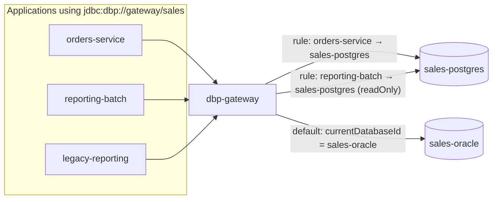

# Migration playbook: Oracle → PostgreSQL per datasource

How to move one **logical datasource** (for example `sales`) from an Oracle physical database to a
PostgreSQL physical database using the platform's routing rules, while 30+ services keep running.
The platform does not copy data and does not translate SQL (see
[Selective SQL compatibility](#selective-sql-compatibility-position)); it makes the move observable,
reversible and incremental, one application at a time.

Related: [rollout.md](rollout.md) (Phase 6), [compatibility.md](compatibility.md),
[control-plane-api.md](control-plane-api.md#5-logical-datasources).

## How routing makes incremental migration possible



Resolution per application (contract): first enabled routing rule by `priority` whose `applicationId`
matches → rule whose `tag` matches an application tag → `currentDatabaseId`. The application's
configuration never changes; only the rule does. Each resolution yields the physical database, its
credential and the pool policy, so the same application can be on PostgreSQL today and back on Oracle in
one API call tomorrow.

## Scope and prerequisites

| Prerequisite                                                        | Why                                                                                          |
|---------------------------------------------------------------------|----------------------------------------------------------------------------------------------|
| All consumers of the datasource use the **driver** (not the proxy)   | Routing rules exist in the gateway only. Proxy clients are pinned to the engine's protocol    |
| Phase 3 complete for the datasource's tables                         | Owners and producers decide the order and sign off                                           |
| Target PostgreSQL registered as a `Database` with its own credential | Gateway pools, collectors                                                                    |
| Schema converted and deployed on PostgreSQL                          | Outside the platform (ora2pg, hand conversion, Flyway/Liquibase). Catalogue it with a dictionary crawl |
| A data synchronisation mechanism                                     | CDC/replication tool, trigger-based dual-write, or application-level dual-write. The platform observes, it does not replicate |
| Metrics baseline for every consumer                                  | Error rate, p95 latency, rows per statement from `GET /stats/queries/top` on Oracle           |

## Step 1 — Readiness checklist

Produce this once per datasource and keep it in the change record.

| Check                                                | How (platform)                                                                                    | Pass criterion                                                   |
|------------------------------------------------------|---------------------------------------------------------------------------------------------------|------------------------------------------------------------------|
| Consumers inventory                                  | `GET /datasources/{id}/summary.consumers`; `GET /impact/datasource/{id}`                          | Every consumer has an owner team and a contact; none unknown     |
| Tables in scope                                      | `GET /tables?databaseId=<oracle>&schema=SALES`                                                     | Every table has `owner`, `producer`, `migration.targetDatabaseId` |
| Cross-datasource joins                               | `QueryStat.tables` spanning schemas of other datasources                                           | None, or an agreed plan (both datasources move together, or the join is removed) |
| Routines / packages / triggers                       | `GET /routines?databaseId=<oracle>&schema=SALES`; per routine `summary.callers` and `tables`       | Each routine is either rewritten in PL/pgSQL, moved to the application, or retired; triggers listed with their writes |
| PL/SQL entry points called by applications           | relationships `kind = CALLS`                                                                       | PostgreSQL equivalents deployed and tested through the gateway (`CALL`/function) |
| SQL compatibility hotspots                           | `GET /stats/queries/top?databaseId=<oracle>&window=7d` scanned for the patterns below              | Every flagged statement has a remediation owner                   |
| Unused tables                                        | `GET /stats/tables/unused?days=90`                                                                 | Decided: migrate, archive or drop                                 |
| Data types                                           | columns of kind `NUMBER` without scale, `DATE` with time, `VARCHAR2` with empty strings, `RAW`, `CLOB/BLOB`, `TIMESTAMP WITH LOCAL TIME ZONE` | Mapping agreed (see rewrite table)                 |
| Sequences                                            | `seq.NEXTVAL` in `QueryStat.sqlNormalized`; `CURRVAL` usage                                        | Target sequences start above the Oracle high-water mark; `CURRVAL` only inside transactions |
| Volume and SLOs                                      | `queryStats.count7d`, p95 per consumer                                                             | Target sized; verification thresholds defined                     |
| Rollback window                                      | Agreed duration during which Oracle stays writable and in sync                                     | Documented                                                        |

### SQL compatibility hotspots the telemetry can flag

The control plane sees `sqlNormalized` for every statement executed through the gateway. The following
patterns are detectable by simple matching on the normalised text (implementation: a "compatibility
hints" report in the UI/queries page; verify availability in your version) and are the usual suspects:

| Pattern in Oracle SQL                 | Detection cue                               | PostgreSQL status                                                  |
|---------------------------------------|---------------------------------------------|--------------------------------------------------------------------|
| `NVL(`, `NVL2(`                       | function name                               | Not present; use `COALESCE` / `CASE`                                |
| `SYSDATE`, `SYSTIMESTAMP`             | identifier                                   | Not present; see rewrite table (semantics differ)                   |
| `DECODE(`                             | function name                               | Not present; `CASE`                                                 |
| `(+)` outer join                      | token                                        | Not present; ANSI `LEFT/RIGHT JOIN`                                 |
| `ROWNUM`                              | identifier                                   | Not present; `LIMIT`/`FETCH FIRST`, `ROW_NUMBER()`                  |
| `.NEXTVAL`, `.CURRVAL`                | suffix                                       | `nextval('seq')`, `currval('seq')`                                  |
| `MERGE INTO`                          | keyword                                      | PostgreSQL 15+ has `MERGE` (subset); older: `INSERT … ON CONFLICT`  |
| `FROM DUAL`                           | table name                                   | Not present; drop the `FROM` clause                                 |
| `CONNECT BY`, `START WITH`            | keywords                                     | Recursive CTE                                                       |
| `LISTAGG(`, `WM_CONCAT(`              | function name                                | `string_agg`                                                        |
| `TRUNC(` on dates, `ADD_MONTHS(`, `MONTHS_BETWEEN(`, `LAST_DAY(` | function name           | `date_trunc`, interval arithmetic; `LAST_DAY` absent                 |
| `TO_DATE(`, `TO_CHAR(` with Oracle format masks | function name                      | Present, but format elements differ (`RR`, `FM`, `TH`, `J`)         |
| `INSTR(`, `SUBSTR(` with negative positions | function name                          | `SUBSTR` present (negative start differs); `INSTR` absent (`strpos`) |
| `MINUS`                               | keyword                                      | `EXCEPT`                                                            |
| `ROWID`                               | identifier                                   | No stable equivalent (`ctid` changes); use the primary key           |
| `/*+ hint */`                         | comment                                      | Ignored by PostgreSQL (harmless, but plans may differ)              |
| `CALL PKG.PROC(?)` / `{call …}`       | `operation = CALL`, `routines[]`             | Package namespaces do not exist; `schema.function` or `CALL schema.procedure` |
| `FOR UPDATE NOWAIT` / `SKIP LOCKED`   | keywords                                     | Both exist in PostgreSQL                                            |
| `RETURNING … INTO`                    | keyword                                      | `RETURNING` without `INTO` (JDBC generated keys)                     |
| Empty string literals `''` compared or inserted | literal (visible before normalisation; the gateway can count them) | Oracle treats `''` as `NULL`; PostgreSQL does not — **semantic trap** |
| Integer division (`a / b` on integer columns) | not detectable by text alone                | Oracle `7/2 = 3.5`; PostgreSQL integer `/` truncates to `3`         |
| Unquoted identifiers                  | mixed case in `sqlNormalized`                | Oracle folds to upper case, PostgreSQL to lower; quoted identifiers must match exactly |

What telemetry cannot see: SQL inside PL/SQL bodies (covered by the dictionary scan), SQL built at
runtime that never executed in the observation window, and semantic differences invisible in text
(`DATE` precision, `NUMBER` rounding, `''` vs `NULL`, implicit conversions).

## Step 2 — Prepare the target and mark the migration

1. `PUT /datasources/{id}` → `state: MIGRATING`, `targetDatabaseId: <postgres>`.
2. For each table: `PUT /tables/{id}` → `migration: { targetDatabaseId, targetSchema, targetName, state: PLANNED }`.
   The graph then shows `MIGRATES_TO` edges and the impact report flags "mid-migration".
3. Deploy the converted schema and routines on PostgreSQL; run `POST /databases/<postgres>/collect
   {"what":"DICTIONARY"}` and compare `GET /databases/{id}/schemas` counts with Oracle.
4. Create the datasource pool for the target: the same `Datasource.poolPolicy` applies to every physical
   database it routes to; adjust `maxConnections` if the PostgreSQL `max_connections` is lower.
5. Start data synchronisation Oracle → PostgreSQL and verify row counts / checksums for every table
   (outside the platform).

## Step 3 — Pilot with a routing rule per application

Order of applications: read-only consumers with low SLO first, then writers that are not the producer
(only if dual-write is in place in both directions — otherwise writers move together with the producer),
then the producer.

```http
POST /api/v1/datasources/{id}/routing-rules
{ "priority": 10, "applicationId": "<reporting-batch>", "databaseId": "<sales-postgres>", "readOnly": true, "enabled": true }
```

* `readOnly: true` makes the gateway open the physical connection read-only; a write from a
  consumer that was believed to be read-only fails fast instead of diverging the two copies.
* New logical sessions pick up the rule within the gateway's config poll (`DBP_CONFIG_POLL_SECONDS`, 5 s).
  Existing logical sessions re-resolve their datasource at every pin (a cache lookup; one
  `/internal/resolve` call after the config version changed), so in TRANSACTION mode they move to the
  new database at their next pin — after the current COMMIT/ROLLBACK and once their cursors are closed —
  while SESSION-mode sessions keep their physical connection until they close. A restart of the
  application is the deterministic way to move all of its sessions.
* The application must have its dialect/behaviour set for PostgreSQL where needed
  (`hibernate.dialect`); see [compatibility.md](compatibility.md#framework-notes).

## Step 4 — Verify

| Signal                                             | Where                                                                                     | Expectation                                                    |
|----------------------------------------------------|-------------------------------------------------------------------------------------------|----------------------------------------------------------------|
| Errors by application and SQLState                 | `GET /stats/queries/top?applicationId=…&databaseId=<postgres>` (`errors`), `dbp_gateway_errors_total` | No `42xxx` (syntax/undefined object) errors after warm-up |
| Latency                                            | `avgDurationMs`, `p95DurationMs` per `sqlHash` vs the Oracle baseline                     | Within the agreed budget per statement class                     |
| Rows per statement                                 | `QueryStat.rows` vs baseline                                                              | Same order of magnitude; large deviations hint at semantic differences (`''` vs `NULL`, case folding) |
| Relationships                                      | `GET /relationships?applicationId=…` now reference tables of the PostgreSQL database       | Every table the app used on Oracle appears on PostgreSQL        |
| Writes landed where expected                       | `GET /tables/{pgTableId}/summary.consumers`                                              | Only the moved application writes the PostgreSQL copy during the pilot (plus the sync tool) |
| Data reconciliation                                | External                                                                                  | Row counts/checksums converge within the sync lag              |
| Pool pressure on PostgreSQL                        | `GET /stats/pools` for the datasource/database pair                                        | `waiting = 0`                                                   |

Run the pilot for at least one full business cycle of the application (daily batch, month-end).

## Step 5 — Move the remaining applications

Add one routing rule per application (or tag applications and use a single tag rule) and repeat the
verification. Keep `GET /impact/datasource/{id}` open: it lists every consumer still routed to the
current (Oracle) database.

When the producer moves, writes to Oracle stop (unless the sync tool now replicates PostgreSQL →
Oracle for the rollback window). From this point the Oracle copy is the follower.

## Step 6 — Switch

When every consumer has a rule pointing at PostgreSQL (`GET /impact/datasource/{id}` shows no
Oracle-routed consumer):

```http
POST /api/v1/datasources/{id}/switch
{ "databaseId": "<sales-postgres>" }
```

This sets `currentDatabaseId`, records a `MigrationEvent` (`fromDatabaseId`, `toDatabaseId`, `at`,
`by`, `note`) and is the moment newly onboarded applications default to PostgreSQL. Then:

1. Delete the per-application rules (`DELETE /datasources/{id}/routing-rules/{ruleId}`) — they are now
   redundant and would mask the default.
2. Set `state: ACTIVE`, `targetDatabaseId: null`; set each table's `migration.state = DONE`.
3. Keep the Oracle database registered and collected for the rollback window: the collectors will show
   whether anything still touches the Oracle tables (`GET /stats/tables/unused?days=…` against the Oracle
   database; `DIRECT_DB_ACCESS_BYPASSING_PLATFORM` violations for anything not using the platform).

## Step 7 — Rollback

| Situation                                             | Action                                                                                                    |
|-------------------------------------------------------|-----------------------------------------------------------------------------------------------------------|
| One pilot application misbehaves                       | Disable or delete its routing rule (`PUT …/routing-rules` with `enabled: false`); restart the app to move all sessions; it is back on Oracle in one config poll |
| Several applications after the switch                  | `POST /datasources/{id}/switch {"databaseId": <sales-oracle>}` (records another `MigrationEvent`); re-add rules only for the applications that should stay on PostgreSQL |
| Data divergence                                        | Rollback is only safe while the sync covers the direction PostgreSQL → Oracle; otherwise reconcile first. This is the reason for the rollback window in the readiness checklist |
| Routines missing on the target                         | Fails fast with `42883` (undefined function) / `42P01` (undefined table) — visible in `errors`; rollback the application, deploy, retry |

Everything above is configuration; no application is redeployed.

## Step 8 — Retire the Oracle tables

After the rollback window with zero Oracle access for the datasource's tables:

1. Revoke the datasource's Oracle account privileges on the tables (so a stray consumer fails loudly).
2. Export/archive per data-retention policy; drop tables, packages and triggers.
3. `DELETE` the Oracle `Database` from the control plane only when nothing else routes to it; otherwise
   leave it registered so the catalogue shows the tables as gone after the next crawl.
4. Record the completion in the datasource `description`/tags and close the change record with the
   `MigrationEvent` ids.

## Selective SQL compatibility position

The platform does **not** attempt to make Oracle SQL run on PostgreSQL. The order of preference is:

1. **Routing first** — move applications one by one; each is tested against PostgreSQL in isolation.
   This removes the need for a big-bang and for perfect translation.
2. **Detection second** — telemetry flags the hotspots above per application and per statement, with
   counts, so remediation is prioritised by evidence rather than by grep.
3. **Translation only where cheap and safe** — a small, explicit, per-datasource rewrite list in the
   gateway is possible (ADR 0010 keeps the hook) for *lexical* rewrites that are provably equivalent
   (`NVL` → `COALESCE`, `FROM DUAL` removal, `MINUS` → `EXCEPT`). It is off by default in the POC and
   must never be relied on for semantics (`SYSDATE`, `''`, integer division, `ROWNUM` ordering).
4. **Application remediation otherwise** — ORMs make most SQL portable already; hand-written SQL is
   fixed in the application, where it can be unit-tested against both engines.

Reasoning in [ADR 0010](adr/0010-selective-sql-compatibility-not-translation.md).

### Common Oracle → PostgreSQL rewrites

| Oracle                                        | PostgreSQL                                                       | Notes                                                                                     |
|-----------------------------------------------|------------------------------------------------------------------|-------------------------------------------------------------------------------------------|
| `NVL(a, b)`                                   | `COALESCE(a, b)`                                                 | `COALESCE` also exists in Oracle: fix it once, works on both                               |
| `NVL2(a, b, c)`                               | `CASE WHEN a IS NOT NULL THEN b ELSE c END`                      |                                                                                           |
| `DECODE(x, 1, 'a', 2, 'b', 'z')`              | `CASE x WHEN 1 THEN 'a' WHEN 2 THEN 'b' ELSE 'z' END`            | `DECODE` treats `NULL = NULL` as a match; `CASE` does not                                  |
| `SYSDATE`                                     | `LOCALTIMESTAMP(0)` or `CURRENT_TIMESTAMP`                       | `SYSDATE` is server time with second precision and advances within a statement; `now()`/`CURRENT_TIMESTAMP` is frozen at transaction start — use `clock_timestamp()` for wall-clock |
| `SYSTIMESTAMP`                                | `CURRENT_TIMESTAMP` (with time zone)                              | Same transaction-start caveat                                                              |
| `TRUNC(SYSDATE)`                              | `CURRENT_DATE` or `date_trunc('day', …)`                          |                                                                                           |
| `date_col + 1`, `SYSDATE - 7`                 | `date_col + INTERVAL '1 day'`; `CURRENT_DATE - 7` works for `date` | `timestamp + integer` is an error in PostgreSQL                                            |
| `ADD_MONTHS(d, n)`                            | `d + (n || ' months')::interval`                                  | End-of-month behaviour differs                                                              |
| `MONTHS_BETWEEN(a, b)`                        | `EXTRACT(year FROM age(a,b))*12 + EXTRACT(month FROM age(a,b))`   | Fractional months differ                                                                   |
| `a.id = b.id (+)`                             | `a LEFT JOIN b ON a.id = b.id`                                     | Rewrite to ANSI joins in Oracle first; both engines accept them                            |
| `WHERE ROWNUM <= 10`                          | `LIMIT 10` / `FETCH FIRST 10 ROWS ONLY`                           | `ROWNUM` is assigned before `ORDER BY`; `FETCH FIRST` (Oracle 12c+) is portable            |
| `ROW_NUMBER() OVER (…)` paging                | identical                                                         | Portable                                                                                   |
| `seq.NEXTVAL`                                 | `nextval('seq')`                                                  | Or `GENERATED … AS IDENTITY` columns; portable form: identity columns on both (Oracle 12c+) |
| `seq.CURRVAL`                                 | `currval('seq')`                                                  | Session-bound on both: requires pinning (see pool modes)                                    |
| `INSERT … RETURNING id INTO :v`               | `INSERT … RETURNING id` via `getGeneratedKeys`                    | Through the gateway use `prepareStatement(sql, new String[]{"ID"})` on both engines         |
| `MERGE INTO … USING … WHEN MATCHED … WHEN NOT MATCHED` | `MERGE` (PostgreSQL 15+) or `INSERT … ON CONFLICT (key) DO UPDATE` | `ON CONFLICT` needs a unique constraint; `MERGE` in PostgreSQL lacks some Oracle clauses (`DELETE WHERE`, conditional updates differ) |
| `SELECT 1 FROM DUAL`                          | `SELECT 1`                                                        | Creating a `dual` view on PostgreSQL is a cheap bridge                                     |
| `MINUS`                                       | `EXCEPT`                                                          |                                                                                           |
| `LISTAGG(x, ',') WITHIN GROUP (ORDER BY x)`   | `string_agg(x, ',' ORDER BY x)`                                   |                                                                                           |
| `CONNECT BY PRIOR id = parent_id START WITH …`| `WITH RECURSIVE … UNION ALL …`                                     | `LEVEL`, `SYS_CONNECT_BY_PATH` must be emulated                                            |
| `INSTR(s, 'x')`                               | `strpos(s, 'x')` / `position('x' IN s)`                           | Oracle `INSTR` with occurrence/negative start has no direct equivalent                     |
| `SUBSTR(s, -3)`                               | `right(s, 3)`                                                     | Negative start counts from the end only in Oracle                                           |
| `REGEXP_LIKE(s, p)`                           | `s ~ p`                                                           | Regex dialects differ slightly                                                              |
| `TO_CHAR(d, 'YYYY-MM-DD HH24:MI:SS')`         | same                                                              | Most common masks match; check `RR`, `FM`, `TH`, `Day` padding                              |
| `TO_DATE('…', 'DD-MON-YYYY')`                 | `to_date` / `to_timestamp`                                        | Oracle `DATE` has a time part; map to `timestamp(0)` unless the column is date-only          |
| `NUMBER` (no scale)                           | `numeric`                                                         | `NUMBER(10)` → `bigint`, `NUMBER(1)` used as boolean → `boolean`                             |
| `VARCHAR2(n)` / `NVARCHAR2`                   | `varchar(n)` / `text`                                             | `''` is `NULL` in Oracle, a value in PostgreSQL: review `IS NULL` checks and `NOT NULL` constraints |
| `DATE`                                        | `timestamp(0)`                                                    |                                                                                           |
| `TIMESTAMP WITH LOCAL TIME ZONE`              | `timestamptz`                                                     |                                                                                           |
| `RAW(16)` / `SYS_GUID()`                      | `uuid` / `gen_random_uuid()`                                      |                                                                                           |
| `CLOB` / `BLOB`                               | `text` / `bytea`                                                  | Large objects (`lo`) are another option; `bytea` travels through the gateway as `BYTES`     |
| `ROWID`                                       | primary key                                                       | `ctid` is not stable across updates/vacuum                                                 |
| PL/SQL package with state                     | PL/pgSQL functions in a schema + explicit state (table, session temp table, or application) | Package variables have no equivalent; packages are the main migration effort     |
| `DBMS_OUTPUT.PUT_LINE`                        | `RAISE NOTICE`                                                    |                                                                                           |
| `PRAGMA AUTONOMOUS_TRANSACTION`               | `dblink`/background worker, or move to the application             | No autonomous transactions in PostgreSQL                                                   |
| `COMMIT` inside a procedure                   | `COMMIT` allowed in procedures (`CALL`) since PostgreSQL 11, not in functions | Transaction control inside routines is restricted                         |
| Triggers `:NEW`/`:OLD`                        | trigger function with `NEW`/`OLD`, `CREATE TRIGGER … EXECUTE FUNCTION` | One trigger function per table event is typical                                       |
| `EXCEPTION WHEN NO_DATA_FOUND`                | `IF NOT FOUND` / `STRICT` with `NO_DATA_FOUND`                     | PL/pgSQL `SELECT INTO` does not raise unless `STRICT`                                      |
| Implicit `TRUNCATE` auto-commit                | `TRUNCATE` is transactional                                        | Behavioural difference, usually welcome                                                     |
| Unquoted `MyTable`                            | lower-case folding                                                | Never quote identifiers in migrated DDL unless you quote them everywhere                    |
| `7 / 2`                                       | `7 / 2.0` or cast                                                 | Integer division truncates in PostgreSQL                                                   |

Rows marked "portable" are worth applying on Oracle *before* the migration: the application then runs
the same SQL on both engines, and the pilot tests only the engine, not a new codebase.
