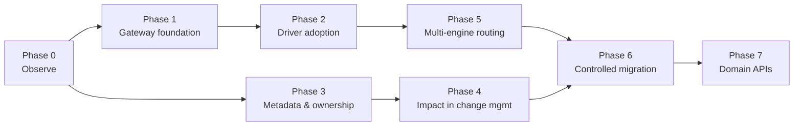

# Rollout plan

A phased plan for introducing the Database Access Platform into an estate of 30+ backend services and
50+ UI services that are being carved out of a few legacy application instances, while the data they
share stays on Oracle and is migrated table by table to PostgreSQL.

Each phase maps to concrete components (see `architecture.md`) and has a measurable exit. Phases
overlap in practice: the proxy and the collectors from Phase 0 keep running for the lifetime of the
platform, and Phases 3–4 (metadata, impact analysis) start as soon as the first telemetry arrives.

Related documents: [operations.md](operations.md) (running the components), [compatibility.md](compatibility.md)
(what works through the driver), [migration-playbook.md](migration-playbook.md) (Phase 6 in detail),
[collectors.md](collectors.md) (Phase 0 data sources), [security.md](security.md).

## Phase overview

| Phase | Name                               | Components involved                                   | Primary outcome                                                     |
|-------|------------------------------------|-------------------------------------------------------|---------------------------------------------------------------------|
| 0     | Observe                            | `dbp-proxy`, control plane collectors, `dbp-ui`        | Know who connects to what, with how many sessions, touching which tables and PL/SQL entry points |
| 1     | Gateway foundation                 | `dbp-gateway`, `dbp-control-plane`                     | Bounded physical pools and central credentials for the first services |
| 2     | Drop-in driver adoption            | `dbp-jdbc`, `dbp-gateway`                              | Most services use `jdbc:dbp://…`; application code unchanged         |
| 3     | Metadata and ownership             | `dbp-control-plane`, `dbp-ui`                          | Every table has an owner and a producer; inferred relationships confirmed |
| 4     | Graph and impact in change management | `dbp-control-plane`, `dbp-ui`                       | No DDL without an impact check                                       |
| 5     | PostgreSQL / SQL Server routing    | `dbp-gateway`, `dbp-proxy`, collectors                 | The same control plane fronts all engines                            |
| 6     | Controlled migration per datasource| all                                                   | Datasources moved Oracle → PostgreSQL application by application     |
| 7     | Domain APIs                        | outside the platform; informed by it                   | Direct table access replaced by APIs where the graph says it pays off |



Durations are deliberately not given: they depend on the number of applications, release cadence and
DBA availability. Each phase lists the metrics that tell you when it is done.

Terminology used below is defined in [glossary.md](glossary.md): *logical datasource*, *physical
database*, *logical session*, *physical connection*, *pinning*, *pool mode*, *relationship* (application
→ object, observed at runtime) versus *dependency* (object → object, from the data dictionary),
*owner / producer / consumer*.

---

## Phase 0 — Observe

### Goals

* Establish the baseline: how many Oracle sessions exist, which application/instance/pool holds them,
  which tables are hot, which PL/SQL routines are entry points, and which tables nobody uses.
* Make every connection attributable to an application without changing application code.
* Give DBAs a single screen (`dbp-ui` → Connections, Queries, Tables) instead of ad-hoc `V$SESSION` queries.

### Prerequisites

| Item                                    | Detail                                                                                   |
|-----------------------------------------|------------------------------------------------------------------------------------------|
| Collector account on each Oracle database | Least privilege as in [security.md](security.md#least-privilege-for-collector-accounts): `CREATE SESSION` + `SELECT_CATALOG_ROLE` (or `SELECT ANY DICTIONARY`), `AUDIT_VIEWER` only if unified audit is enabled |
| Control plane running                   | H2 is fine for Phase 0 evaluation; PostgreSQL metadata store before Phase 1 (see [operations.md](operations.md)) |
| Inventory of applications and teams     | Loaded via `POST /api/v1/import` or the UI: `Team`, `Application` with `identityRules` (CIDRs, program names, machine patterns, service aliases) |
| Network path for the proxy              | A host/pod that can reach the Oracle listener; applications can reach the proxy on 1521   |

### Steps

1. **Register** databases (`POST /databases`, `test-connection`) and enable the collector with
   `dictionaryIntervalSeconds` (hourly is typical) and `runtimeIntervalSeconds` (10–30 s).
2. **Crawl the dictionary** (`POST /databases/{id}/collect {"what":"DICTIONARY"}`) and verify
   `GET /databases/{id}/schemas` shows the expected tables and routines.
3. **Register applications** with identity rules. Start with `cidrs` and `programNames` (what you see
   today in `V$SESSION.PROGRAM/MACHINE`), then tighten.
4. **Deploy the proxy** with a listener per engine (`GET /internal/proxy/config` defines routes).
   Default route = the existing database so that unknown clients still work.
5. **Repoint applications** to the proxy in waves, changing only the JDBC URL host/port. Where the
   deployment pipeline allows, use the service alias form `<datasource>.<application>` as
   `SERVICE_NAME` so identity is exact (`identitySource = SERVICE_ALIAS`).
6. **Enable proxy correlation**: once connections flow through the proxy, the runtime collector joins
   `V$SESSION.PORT` with `ConnectionEvent.proxyLocalPort` (see [collectors.md](collectors.md#proxy-correlation)).
7. Optionally enable **unified audit** on the schemas of interest for `COLLECTOR_AUDIT` relationships
   with confidence 1.0 (a DBA decision; see licence notes in [collectors.md](collectors.md#licence-notes)).
8. Review the dashboards weekly: connections by application/instance, sessions per DB user, hot
   tables, unused tables, PL/SQL entry points (`GET /routines?kind=PROCEDURE|FUNCTION|PACKAGE` with callers).

### What to measure

| Measure                                     | Source                                                              | Why it matters                                        |
|---------------------------------------------|---------------------------------------------------------------------|-------------------------------------------------------|
| Connections per application / instance / pool | proxy `ConnectionEvent`s, `GET /stats/connections?groupBy=application` | Shows the services × instances × pool-size multiplication |
| Sessions per Oracle user                     | collector session samples (`GET /connections/live`)                 | Shared credentials show up as one user with many programs |
| Idle vs active ratio per pool                | collector session samples (`STATUS`), proxy durations               | Sizing input for Phase 1 pools                        |
| Hot tables (reads/writes/apps/teams)         | `GET /stats/tables/hot`                                             | Candidates for ownership and for API extraction        |
| Unused tables                                | `GET /stats/tables/unused?days=30`                                  | Candidates for retirement before migration             |
| PL/SQL entry points and their fan-out        | `GET /routines/{id}/summary` (dependencies, callers)                | Migration scope and trigger/package risk                |
| Unknown connections                          | `ConnectionEvent.identitySource = NONE`                             | Identity-rule gaps                                      |

### Exit criteria

* ≥ 95 % of proxied connections resolve to an application (`identitySource != NONE`).
* Every production database has a successful dictionary crawl and a runtime run in the last interval
  (`GET /databases/{id}/collector-status`).
* A documented baseline: sessions per database at peak, top 20 tables by access, list of PL/SQL entry
  points per schema.

### Risks

| Risk                                                     | Mitigation                                                                              |
|----------------------------------------------------------|------------------------------------------------------------------------------------------|
| Proxy becomes a single point of failure for repointed apps | Run ≥ 2 proxy instances behind a TCP load balancer or DNS; keep the default route; keep the old URL in the app config for fast rollback |
| Sampling misses short statements                          | Accept: `COLLECTOR_SESSION` confidence is 0.6; proxy correlation and gateway telemetry fix this later |
| TLS/TCPS between app and Oracle hides the connect packet  | See [security.md](security.md#tls); use native network encryption (passes through) or terminate at the app side during Phase 0 |
| Collector load on the database                            | Keep runtime sampling ≥ 10 s; the collector reads only `V$` and dictionary views, no ASH/AWR     |

### Metrics

`dbp_proxy_connections_active`, `dbp_proxy_connections_refused_total`, `dbp_controlplane_collector_runs_total`,
`GET /stats/overview.connections.proxyActive`, share of `identitySource = NONE`.

---

## Phase 1 — Gateway foundation

### Goals

* Introduce the gateway for a handful of services and prove: bounded physical pools, centralised DB
  credentials (api keys for apps), per-statement telemetry with table extraction.
* Define the first logical datasources and access grants.

### Prerequisites

| Item                                 | Detail                                                                                              |
|--------------------------------------|-----------------------------------------------------------------------------------------------------|
| Control plane on PostgreSQL          | `DBP_DB_URL` pointing at a PostgreSQL metadata store, backups configured ([operations.md](operations.md#backup-of-the-metadata-store)) |
| `DBP_MASTER_KEY` and `DBP_SERVICE_TOKEN` set | Non-default values; see [security.md](security.md)                                           |
| Dedicated Oracle account per datasource (recommended) | e.g. `SALES_APP` for datasource `sales`; registered as a `Credential` (INLINE/ENV/FILE) |
| Pilot services chosen                | 2–3 stateless services with simple JDBC usage (Spring `JdbcTemplate`/JPA, autocommit or short transactions) |

### Steps

1. Create logical datasources (`POST /datasources`) with `poolPolicy` (`mode: TRANSACTION`,
   `maxConnections` from the Phase 0 baseline — start at ~25 % of the sessions those services held before).
2. Create access grants (`POST /access-grants`) per application with `maxLogicalConnections`.
3. Issue api keys (`POST /applications/{id}/api-keys`) and store them in the application's secret store.
4. Deploy ≥ 2 gateway instances (`DBP_CONTROL_PLANE_URL`, `DBP_GATEWAY_ID`), verify `/health` on 7421 and
   that `GET /components` lists them.
5. Switch the pilot services to the driver (Phase 2 recipe) in a non-production environment first.
6. Load-test one pilot service through the gateway versus direct; record latency deltas (to be measured;
   see [faq.md](faq.md#what-is-the-overhead)).
7. Roll to production during a low-traffic window; keep the previous JDBC URL as a rollback.

### Exit criteria

* Pilot services run through the gateway for ≥ 2 weeks without gateway-originated errors
  (`08001`, `HY000`) above the agreed budget.
* Physical connections for those services dropped to the configured pool bound
  (`PoolStats.total ≤ max`), visible in `GET /stats/pools`.
* No DB password is present in the pilot services' configuration.
* Per-statement telemetry produces `GATEWAY` relationships for every table the pilot services touch.

### Risks

| Risk                                                     | Mitigation                                                                                 |
|----------------------------------------------------------|---------------------------------------------------------------------------------------------|
| A pilot service relies on session state (temp tables, package variables) | Use `poolModeOverride: SESSION` on its grant; see [compatibility.md](compatibility.md#pool-mode-semantics) |
| Pool bound too low → `08001` timeouts under peak          | Start generous, tighten with data; alert on `waiting > 0` for sustained periods              |
| Control plane outage                                      | Gateways cache resolution results and keep serving (see [faq.md](faq.md)); verify this in staging by stopping the control plane |

### Metrics

`dbp_gateway_logical_sessions`, `dbp_gateway_pool_active/idle/waiting`, `dbp_gateway_statement_duration_seconds`,
`dbp_gateway_errors_total`, `dbp_gateway_telemetry_dropped_total`.

---

## Phase 2 — Drop-in driver adoption

### Goals

Move the majority of services to `jdbc:dbp://` with no code change: a jar, a URL and an api key.

### What changes in an application

| Before                                             | After                                                                                 |
|----------------------------------------------------|---------------------------------------------------------------------------------------|
| `ojdbc11.jar` (or `postgresql.jar`) on the classpath | `dbp-jdbc-<ver>-all.jar` (zero dependencies; the vendor driver may stay but is unused) |
| `jdbc:oracle:thin:@//db-host:1521/FREEPDB1`         | `jdbc:dbp://gateway-a:7420,gateway-b:7420/sales?ssl=true`                             |
| `username=SALES_APP`, `password=<db password>`      | `password=dbp_<prefix>_<secret>` (or `apiKey=` in the URL); `username` is informational |
| Local HikariCP pool of 20–50                        | Local pool stays (it now holds cheap logical connections); size it to the app's concurrency, not the DB's |

Driver class: `org.dbplatform.jdbc.DbpDriver`. Spring Boot cannot infer the driver from an unknown URL
prefix, so set `driver-class-name` explicitly.

#### Spring Boot (HikariCP)

```yaml
spring:
  datasource:
    url: jdbc:dbp://gateway-a:7420,gateway-b:7420/sales?ssl=true&clientInfo.ApplicationName=orders-service
    driver-class-name: org.dbplatform.jdbc.DbpDriver
    username: orders-service            # informational
    password: ${DBP_API_KEY}            # api key issued by the control plane
    hikari:
      maximum-pool-size: 20             # logical connections; cheap on the gateway side
      connection-timeout: 10000
  jpa:
    database-platform: org.hibernate.dialect.OracleDialect   # set explicitly, see compatibility.md
```

#### Plain HikariCP

```java
HikariConfig cfg = new HikariConfig();
cfg.setDriverClassName("org.dbplatform.jdbc.DbpDriver");
cfg.setJdbcUrl("jdbc:dbp://gateway-a:7420/sales");
cfg.addDataSourceProperty("apiKey", System.getenv("DBP_API_KEY"));
cfg.addDataSourceProperty("clientInfo.ApplicationName", "orders-service");
cfg.setMaximumPoolSize(20);
DataSource ds = new HikariDataSource(cfg);
```

#### JPA / Hibernate

Set the dialect explicitly for the engine the application is routed to (`hibernate.dialect` /
`spring.jpa.database-platform`). `HELLO_OK.serverProperties.databaseProductName` reports the physical
engine, so auto-detection works at startup, but a routing change (Phase 6) changes the engine; an
explicit value makes that dependency visible in configuration. Details in
[compatibility.md](compatibility.md#framework-notes).

#### MyBatis

```xml
<dataSource type="POOLED">
  <property name="driver" value="org.dbplatform.jdbc.DbpDriver"/>
  <property name="url" value="jdbc:dbp://gateway-a:7420/sales"/>
  <property name="username" value="orders-service"/>
  <property name="password" value="${DBP_API_KEY}"/>
</dataSource>
```

### What to test per application

| Test                                             | Why                                                                                   |
|--------------------------------------------------|---------------------------------------------------------------------------------------|
| Full regression / integration suite against a gateway in a test environment | Catches unsupported JDBC features (`0A000`) early — see [compatibility.md](compatibility.md) |
| Transactions spanning several statements          | Verifies pinning: all statements of a transaction hit one physical connection          |
| Stored procedure calls incl. OUT / REF CURSOR     | Protocol path differs from plain statements                                             |
| Batch inserts                                     | `EXECUTE_BATCH` path and update counts                                                 |
| LOB columns near your largest size                | Frame limit (`maxFrameBytes`, default 64 MiB) and `fetchSize` interaction              |
| Failover: stop one gateway during load            | Driver tries hosts in order at connect time; the local pool replaces dead connections   |
| Credential rotation during load                   | Old physical connections drain; app unaffected                                          |
| Latency under peak                                | One extra hop; measure p50/p95 before and after                                         |

### Which applications should use SESSION mode

Set `poolPolicy.mode: SESSION` on the datasource (or `poolModeOverride` on the grant) when an
application relies on state that lives in the server session *between* transactions:

* PL/SQL package variables or `DBMS_SESSION` context read in a later transaction;
* global temporary tables with `ON COMMIT PRESERVE ROWS` used across transactions;
* `ALTER SESSION` (NLS settings, `CURRENT_SCHEMA`) issued at connect time by the application itself
  (note: `SET_SCHEMA`/client info sent through JDBC APIs are replayed by the gateway in both modes);
* `sequence.CURRVAL` read outside the transaction that called `NEXTVAL`;
* `DBMS_OUTPUT`, `DBMS_APPLICATION_INFO` read back later; PostgreSQL `LISTEN/NOTIFY`, session-level
  advisory locks, `SET` (not `SET LOCAL`) parameters;
* schema migration tools (Flyway, Liquibase) — see [compatibility.md](compatibility.md#framework-notes).

Legacy applications (`kind: LEGACY`) usually start in SESSION mode; SESSION mode gives identity,
credentials and telemetry but no reduction in physical connections (1 logical = 1 physical while open).

### Exit criteria

* ≥ 80 % of services on the driver; the rest documented with a reason (proxy-only, SESSION mode, vendor feature).
* Total Oracle sessions from gateway pools ≤ the Phase 0 baseline × agreed factor (target to be set per database).
* Zero DB passwords in application configuration for driver-based apps.

### Risks

| Risk                                              | Mitigation                                                                          |
|---------------------------------------------------|--------------------------------------------------------------------------------------|
| Hidden vendor API usage (`unwrap(OracleConnection)`, `oracle.sql.*`) | Grep the codebase before migrating; such apps stay on the proxy or are remediated |
| Fetch-size tuning differences                      | The driver default is 100 rows per `ROWS` frame; tune `fetchSize` per app              |
| Teams fear "another hop"                           | Publish the measured latency delta from Phase 1                                        |

### Metrics

Share of applications by access path (direct / proxy / gateway), `dbp_gateway_statements_total` by application,
`08004` count (misconfigured keys), `0A000` count (unsupported features).

---

## Phase 3 — Metadata and ownership

### Goals

Every table and routine has an owner team; every table has a producer; inferred relationships are
confirmed or declared; cross-team access is visible and acknowledged.

### Prerequisites

* Dictionary crawls and runtime telemetry from Phases 0–2 for ≥ 30 days (`DBP_RELATIONSHIP_STALE_DAYS`).
* Teams and applications complete in the control plane.

### Steps

1. **Bulk ownership** by schema where schemas already follow team lines:
   `POST /tables/bulk-ownership {"databaseId","schema":"SALES","teamId"}` (writes table-level rows,
   `ownerSource = DECLARED`).
2. **Review inferred owners** (`GET /tables?unowned=true`, UI → Tables → "inferred"): the platform
   proposes the team of the sole writer in the window. Confirm with `POST /tables/{id}/ownership {"teamId","confirmed":true}`.
3. **Declare producers** (`PUT /tables/{id}` → `producerApplicationId`). Where several applications
   write the same table, decide which one is authoritative; the others become `WRITE_BY_NON_PRODUCER`
   violations to work down.
4. **Confirm relationships** that are intended (`PUT /relationships/{id} {"confirmed":true}`) and
   **declare** the ones telemetry cannot see yet (e.g. a quarterly batch): `POST /relationships` (`DECLARED`).
5. **Classify** sensitive columns (`PUT /tables/{id}/columns/{columnId}` → `classification: PII`).
6. Enable governance policies incrementally: `UNOWNED_TABLE` first, then `UNDECLARED_CONSUMER`,
   `CROSS_TEAM_DIRECT_ACCESS`, `WRITE_BY_NON_PRODUCER`, finally `DIRECT_DB_ACCESS_BYPASSING_PLATFORM`.

### Exit criteria

* `GET /stats/overview.unownedTables = 0` for in-scope schemas.
* Every table with runtime writes has a producer.
* Open governance violations triaged (status `ACKNOWLEDGED` with a note, or `RESOLVED`).

### Risks

| Risk                                       | Mitigation                                                                                     |
|--------------------------------------------|-------------------------------------------------------------------------------------------------|
| Ownership disputes                          | Use the graph (`GET /graph?root=table:…`) and query counts as evidence; escalate with data        |
| Inferred owner wrong because of a shared batch user | Prefer `GATEWAY`/`PROXY_CORRELATION` evidence; `COLLECTOR_SESSION` alone is 0.6 confidence  |
| Seasonal consumers missed                   | Declare them; the stale marker will not remove DECLARED relationships                             |

### Metrics

Unowned tables, tables without producer, open violations by kind, share of relationships `confirmed`.

---

## Phase 4 — Graph and impact analysis in change management

### Goals

Make the impact report a mandatory artefact of every schema change and of every service decommissioning.

### Pre-DDL impact check procedure

1. Identify the target: `GET /tables?q=CUSTOMER&databaseId=…` → table id (or column id).
2. Run `GET /impact/table/{id}` (or `/impact/column/{columnId}` for column drops/renames/type changes).
3. Read the report: `directConsumers`, `indirectConsumers` (via routines/triggers), `dependentViews`,
   `foreignKeyDependents`, `teamsAffected`, `queryStats.count7d`, `riskScore`, `riskFactors`.
4. For `riskScore ≥ 0.5` (threshold to be agreed) notify every team in `teamsAffected` through the
   team `contacts`, and attach the report to the change ticket.
5. Check `queriesReferencingColumn` (column impact) to find exact SQL to update.
6. Re-run the report after the change window to confirm the consumer set shrank as expected.

### Steps

* Integrate the report into the change-management template (link or JSON attachment).
* Give DBAs and team leads access to the UI's Impact Analysis and Graph Explorer.
* Add an "application retirement" variant: `GET /applications/{id}/summary` → tables only it wrote
  become candidates for archival.

### Exit criteria

* 100 % of production DDL changes in scope carry an impact report for one full release cycle.
* No incident caused by an unknown consumer in that cycle.

### Risks

* Relationships derived from sampling under-report rare consumers → combine with DECLARED relationships
  and keep the retention window long enough (`DBP_TELEMETRY_RETENTION_HOURS` for raw events; aggregated
  `QueryStat` rows and relationships persist).

### Metrics

Impact reports generated per change, incidents attributed to unknown consumers (target 0).

---

## Phase 5 — PostgreSQL / SQL Server routing

### Goals

Front PostgreSQL (and SQL Server where present) with the same gateway, proxy and collectors so that a
logical datasource can point at any engine.

### Steps

1. Register PostgreSQL databases with their collector (`pg_catalog`, `pg_stat_activity`, optional
   `pg_stat_statements`; account in `pg_monitor`). Register SQL Server with `VIEW SERVER STATE` and
   `VIEW DEFINITION`.
2. Add proxy listeners for 5432 / 1433 where legacy tools connect directly.
3. Create the first PostgreSQL-backed datasources for new (greenfield) services.
4. Run the compatibility suite of [compatibility.md](compatibility.md) against PostgreSQL through the gateway.

### Exit criteria

* A greenfield service runs through the gateway on PostgreSQL in production.
* Collectors produce dictionary and runtime data for all engines in scope.

### Risks

* PostgreSQL client-side SSL through the proxy is limited (see [security.md](security.md#tls)); the gateway path is preferred.

---

## Phase 6 — Controlled migration per datasource

Full detail in [migration-playbook.md](migration-playbook.md). Summary runbook:

| Step | Action                                                                                                      | API / evidence                                              |
|------|-------------------------------------------------------------------------------------------------------------|-------------------------------------------------------------|
| 1    | Readiness checklist: consumers, routines/triggers, SQL hotspots flagged by telemetry, data-copy strategy    | `GET /datasources/{id}/summary`, `GET /impact/datasource/{id}` |
| 2    | Mark the datasource `MIGRATING`, set `targetDatabaseId`; set `Table.migration` per table                    | `PUT /datasources/{id}`, `PUT /tables/{id}`                  |
| 3    | Dual-write / replication in place and verified (outside the platform: CDC, triggers, or application dual-write) | reconciliation report                                     |
| 4    | Pilot: routing rule for one application to the target database                                              | `POST /datasources/{id}/routing-rules {applicationId, databaseId, priority}` |
| 5    | Verify: error rate, latency, telemetry shows the app reading/writing the target; compare row counts         | `GET /stats/queries/top?applicationId=…&databaseId=…`         |
| 6    | Add applications rule by rule (read-only consumers first, producer last)                                   | routing rules                                                |
| 7    | Switch the default: `POST /datasources/{id}/switch {"databaseId": target}` → `MigrationEvent`; remove rules | `GET /migration-events?datasourceId=…`                        |
| 8    | Rollback (any time before Oracle write-path is retired): per-app rule back to Oracle, or `switch` back       | same APIs                                                    |
| 9    | Retire: `Table.migration.state = DONE`, revoke Oracle grants, drop or archive tables after the unused window | `GET /stats/tables/unused`                                   |

### Exit criteria

Datasource `state = ACTIVE` on the target engine with no routing rules pointing at Oracle; Oracle tables
of the datasource show no runtime access for the agreed window.

### Risks

See the playbook: data divergence during dual-write, SQL incompatibilities not detected by telemetry
(dynamic SQL), PL/SQL that has no equivalent, sequence gaps.

---

## Phase 7 — Domain APIs for selected domains

### Goals

Use the graph to pick the tables where direct cross-team access is most expensive and replace it with a
domain API owned by the producing team. The platform does not implement the APIs; it tells you where
they pay off and verifies that direct access actually disappears.

### Steps

1. Rank tables by `GET /stats/tables/hot` (`teams ≥ 3`) and `CROSS_TEAM_DIRECT_ACCESS` violations.
2. For each candidate, list consumers and their query shapes (`GET /tables/{id}/summary.topQueries`).
3. The owner team publishes an API covering those query shapes; consumers migrate.
4. Enforce: remove the consumers' access grants for the datasource (or set `readOnly`); watch for `08004`
   attempts and `DIRECT_DB_ACCESS_BYPASSING_PLATFORM` violations.

### Exit criteria

For each selected domain: cross-team relationships to its tables are zero (or DECLARED and justified)
for the agreed window.

### Metrics

Cross-team accesses (`GET /stats/overview.crossTeamAccesses`), violations by kind, consumers per hot table.

---

## Cross-phase checklist

| Concern                | Where it is handled                                                   |
|------------------------|------------------------------------------------------------------------|
| Security hardening     | [security.md](security.md) — before Phase 1 in any production estate    |
| Backups                | [operations.md](operations.md#backup-of-the-metadata-store) — before Phase 1 |
| Alerting               | [operations.md](operations.md#alerting-suggestions) — from Phase 1      |
| Capacity planning      | [operations.md](operations.md#capacity-planning) — Phase 1 onwards      |
| Rollback paths         | Each phase keeps the previous access path configured and tested         |
