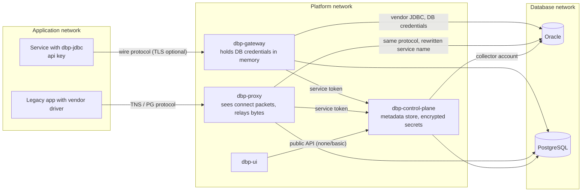

# Security

Threat model, trust boundaries and the controls the platform provides today, with the gaps that are
roadmap items. The POC defaults are deliberately permissive (`DBP_SECURITY_MODE=none`,
`DBP_SERVICE_TOKEN=dev-service-token`); this page lists what to change before any production use.

Related: [operations.md](operations.md) (configuration), [collectors.md](collectors.md) (collector
accounts), [control-plane-api.md](control-plane-api.md) (api-key and credential endpoints).

## Trust boundaries



| Boundary                        | What crosses it                                                   | Control                                                                 |
|---------------------------------|-------------------------------------------------------------------|-------------------------------------------------------------------------|
| Application → gateway           | api key, SQL, parameters, result rows                             | api key auth (`08004` on failure), access grant per datasource, TLS (`ssl=true`), quotas |
| Application → proxy             | vendor protocol as-is; connect packet read for identity/routing   | quotas per application/datasource, route allow-list, network policy; **no authentication by the proxy** (the database authenticates) |
| Gateway/proxy → database        | DB credentials (gateway only), SQL, native protocol               | one DB account per datasource, credentials fetched from the control plane, native encryption/TLS to the DB |
| Gateway/proxy → control plane   | service token, telemetry (normalised SQL, no literals), credential material | `X-DBP-Service-Token`, network policy, TLS termination in front of the control plane (ingress) |
| Control plane → database        | collector account                                                 | least-privilege read-only account ([below](#least-privilege-for-collector-accounts)) |
| Operator/UI → control plane     | configuration, secrets on create/rotate only                      | `DBP_SECURITY_MODE` (`none`/`basic` in the POC), OIDC on the roadmap    |

## Threat model

| # | Threat                                                            | Affected boundary       | Mitigation today                                                                                  | Residual / roadmap                                |
|---|-------------------------------------------------------------------|-------------------------|---------------------------------------------------------------------------------------------------|---------------------------------------------------|
| 1 | Stolen api key used from an unauthorised workload                  | app → gateway           | Keys scoped to one application; grant per datasource; `lastUsedAt` for detection; revoke instantly | Keys are bearer secrets: mTLS/SPIFFE workload identity |
| 2 | DB password sprayed across deployments and leaked                  | app → DB                | Applications never hold DB passwords; gateway fetches them from the control plane                  | Legacy apps on the proxy still hold passwords      |
| 3 | Stale instance locks the account after password rotation           | app → DB                | Rotation happens in one place; gateways drain and reconnect; apps unaffected                       | Proxy-path apps still need redeploy               |
| 4 | Bypass: an application connects to the DB directly                 | app → DB                | NetworkPolicy/firewall: only gateway, proxy and control plane may reach DB ports; `DIRECT_DB_ACCESS_BYPASSING_PLATFORM` policy flags sessions the collectors see without a platform origin | Enforcement depends on the network layer |
| 5 | Forged telemetry or config pull by a rogue component               | component → control plane | Shared service token; internal endpoints on a separate path prefix                                | Per-component credentials, mTLS                   |
| 6 | Secret material read from the control plane                        | control plane           | `GET /internal/credentials/{id}/material` requires the service token and is audited; INLINE secrets encrypted with `DBP_MASTER_KEY`; public endpoints never return secrets | Rotate the service token; external secret providers |
| 7 | Metadata store dump leaks credentials                              | control plane storage   | INLINE secrets encrypted at rest; api keys stored hashed; `DBP_MASTER_KEY` kept outside the DB     | Envelope encryption with a KMS                    |
| 8 | SQL injection through the platform                                 | app → gateway → DB      | The gateway executes what the application sends; parameters travel typed and are bound with `PreparedStatement` on the physical side; no SQL is constructed from telemetry | Same exposure as direct JDBC; policy-based blocking (`42000`) is a hook, not a WAF |
| 9 | Eavesdropping between app and gateway                              | network                 | TLS on 7420 (`ssl=true`, `DBP_GATEWAY_TLS_KEYSTORE`)                                              | Certificate pinning / mTLS                        |
|10 | Sensitive data in telemetry/logs                                   | control plane           | Only normalised SQL (literals replaced by `?`) and parameter *counts*; no parameter values, no result rows; error messages truncated | Vendor error messages can embed values; see [Secrets never in logs](#secrets-never-in-logs-or-telemetry) |
|11 | Denial of service: one application exhausts a pool                 | gateway                 | `maxLogicalConnections` per grant, pool bound per datasource, `statementTimeoutSeconds`, `maxOpenCursorsPerSession` | Per-application fair-share in the pool |
|12 | Operator misuse (switching a datasource, revoking grants)          | operator → control plane | `MigrationEvent` records `by`; `DBP_SECURITY_MODE=basic` in the POC                                | OIDC + roles, approval workflows                  |

## Application identity (api keys)

Format: `dbp_<prefix>_<secret>`.

| Aspect       | Behaviour                                                                                                                     |
|--------------|-------------------------------------------------------------------------------------------------------------------------------|
| Issue        | `POST /applications/{id}/api-keys {"label":"prod"}` → plaintext returned **once**. Store it in the application's secret store.   |
| Storage      | The control plane stores the `prefix` in clear (lookup) and a salted hash of the secret; `GET …/api-keys` never returns secrets. |
| Use          | Driver sends it in `HELLO.properties.apiKey` (URL `apiKey=` or the JDBC `password`). The gateway calls `POST /internal/auth/application` once per HELLO and caches positive results for `DBP_AUTH_CACHE_SECONDS` (60 s), negative ones for 5 s; a stale cache entry keeps serving while the control plane is down. |
| Scope        | One key ↔ one application. Datasource access is a separate `AccessGrant`; a valid key without a grant gets `08004`.             |
| Rotation     | Issue a second key (`label: "prod-2026-10"`), deploy it, confirm `lastUsedAt` moves on the new key and stops on the old one, then revoke the old one. Zero-downtime because both are valid during the overlap. |
| Revocation   | `DELETE /applications/{id}/api-keys/{keyId}` sets `revokedAt`. New sessions fail with `08004` once the gateway's positive cache entry expires (≤ `DBP_AUTH_CACHE_SECONDS`, 60 s). **Existing logical sessions are not terminated**: the gateway authenticates at HELLO only and re-resolves the datasource (not the key) at each pin, so they live until the application closes them — restart the workload if a key is compromised. |
| Static mode  | A gateway without a control plane (`DBP_GATEWAY_CONFIG`) authenticates only against the optional `applications[].apiKey` entries of its YAML; without that section any `application` hint is accepted. Use only in isolated test environments. |

Why api keys first and not workload identity: see ADR 0011. The key is a bearer secret; its blast
radius is bounded by the grants of the owning application, and it never grants anything on the
database itself.

## Service token for internal endpoints

`/api/v1/internal/**` (auth, resolve, credential material, proxy config, telemetry, heartbeat) is
protected by one shared token sent as `X-DBP-Service-Token` and configured through `DBP_SERVICE_TOKEN`
on the control plane, gateways and proxies.

* Change the default before exposing the control plane to anything but localhost.
* Treat it like a database password: random ≥ 32 bytes, stored in your secret manager, rotated by
  updating the control plane and the components. The control plane accepts exactly one token
  (`DBP_SERVICE_TOKEN`), so a rotation is: restart the control plane with the new value, then restart
  gateways and proxies immediately — in between they get `401`, keep serving from cache and buffer
  telemetry (bounded queue, oldest dropped), so keep the window short.
* Restrict the internal path at the network/ingress layer to the gateway and proxy subnets.
* The same variable gates the proxy's admin API: with `DBP_SERVICE_TOKEN` set, `GET :7431/connections`
  and `GET :7431/config` (client addresses, users, program names, route table) require
  `X-DBP-Service-Token`; `/health` and `/metrics` stay open. The gateway's `/sessions` and `/pools` have
  no authentication — keep both admin ports off application networks (see
  [Network enforcement](#network-enforcement)) or bind them to localhost (`DBP_PROXY_ADMIN_ADDRESS=127.0.0.1`).

## Credential providers

A `Credential` is the database account the platform itself uses (gateway pools, collectors). Secrets
never appear on public endpoints.

| Provider                 | `ref`                                  | Where the secret lives                              | Status   |
|--------------------------|----------------------------------------|-----------------------------------------------------|----------|
| `INLINE`                 | –                                      | Metadata store, encrypted with AES-256-GCM under a key derived as sha-256 of `DBP_MASTER_KEY` (unset → built-in dev key with a `WARN` at startup) | POC |
| `ENV`                    | environment variable name              | Control plane process environment                   | POC      |
| `FILE`                   | file path                              | File mounted into the control plane (e.g. Kubernetes Secret volume); re-read on `rotate` | POC |
| `VAULT`                  | secret path                            | HashiCorp Vault (KV/database engine)                | roadmap: accepted as configuration, `GET /internal/credentials/{id}/material` answers `501` |
| `GCP_SECRET_MANAGER`     | secret resource name                   | Google Secret Manager                               | roadmap (`501`) |
| `AWS_SECRETS_MANAGER`    | secret ARN/name                        | AWS Secrets Manager                                 | roadmap (`501`) |

Operational rules:

* Generate `DBP_MASTER_KEY` once, keep it in the secret manager, never in the metadata store or in
  compose files committed to git (`deploy/.env` is git-ignored). Losing it makes INLINE secrets
  unrecoverable; re-entering them via `rotate` is the recovery path.
* Prefer `ENV`/`FILE` over `INLINE` in production so the metadata store never contains DB passwords,
  even encrypted.
* Gateways fetch material on demand (`GET /internal/credentials/{id}/material`) and keep it only in
  memory; the fetch is audited by the control plane (logger
  `org.dbplatform.controlplane.audit.credentials`: which credential, when, which component).
* One DB account per datasource (not per application) is the recommended granularity: it keeps the
  Oracle user count manageable while telemetry provides per-application attribution.

## TLS

| Hop                              | Mechanism                                                                                                                         | Notes                                                                                                 |
|----------------------------------|-----------------------------------------------------------------------------------------------------------------------------------|-------------------------------------------------------------------------------------------------------|
| Driver → gateway                 | TLS on 7420; driver `ssl=true`, gateway `DBP_GATEWAY_TLS_KEYSTORE` + `DBP_GATEWAY_TLS_KEYSTORE_PASSWORD` (PKCS12/JKS). Protocol unchanged under TLS. | The driver uses `SSLSocketFactory.getDefault()`: trust comes from the JVM trust store (`javax.net.ssl.trustStore` system properties); there is no driver-level truststore property. Hostname verification follows the JVM default. |
| Gateway → database               | Vendor driver settings via `Database.jdbcProperties` (Oracle: `oracle.net.encryption_client=REQUIRED` for native network encryption, or a TCPS URL with wallet/truststore; PostgreSQL: `ssl=true&sslmode=verify-full`; SQL Server: `encrypt=true;trustServerCertificate=false`). | Standard vendor configuration; the gateway does nothing special.                                     |
| Proxy ↔ Oracle                   | **Native network encryption (ANO) passes through**: the TNS connect packet (service name, program, host, user) is in clear, the encryption is negotiated afterwards end-to-end between client and server. | TCPS (TLS from the client) would hide the connect packet, so the proxy could neither identify nor route; not supported in the POC. |
| Proxy ↔ PostgreSQL               | Limitation: the client sends `SSLRequest` before the startup message. The POC proxy answers `N` (no SSL) and reads the startup message in clear; clients must allow it (`sslmode=prefer` falls back, `sslmode=require` fails). The proxy → server leg may still use SSL. | Roadmap: TLS termination in the proxy with its own certificate.                                      |
| Proxy ↔ SQL Server               | TDS negotiates encryption in pre-login; with `encrypt=true` (default in recent drivers) the LOGIN7 packet (application name, host, database) is encrypted and invisible to the proxy. | Identity via CIDR only, or `encrypt=false` inside a trusted network, or TLS termination (roadmap). |
| Components → control plane       | Plain HTTP inside the platform network in the POC                                                                                 | Terminate TLS at an ingress/sidecar; `DBP_CONTROL_PLANE_URL` may be `https://` (JVM trust store; the telemetry client accepts a custom `HttpClient` for other trust settings). |

## Network enforcement

The platform's value depends on applications not being able to go around it.

* **Only gateway, proxy and control plane (collectors) may reach database ports.** Express this as a
  Kubernetes `NetworkPolicy` on the database namespace (or firewall rules/security groups for VMs):
  ingress to 1521/5432/1433 from the `dbp-gateway`, `dbp-proxy` and `dbp-control-plane` labels only.
* Applications reach the gateway (7420) and the proxy (1521/5432/1433 on the proxy service) only.
* Admin ports (7421, 7431) and the control plane's `/api/v1/internal/**` are reachable from the platform
  namespace and monitoring only (`deploy/k8s/networkpolicy.yaml` admits 7421/7431 from namespaces
  labelled `dbp.io/monitoring=true`). Prometheus needs only `/metrics`, which never requires the token.
* The `DIRECT_DB_ACCESS_BYPASSING_PLATFORM` governance policy uses collector session samples to flag
  database sessions whose client address is neither a gateway nor a proxy; it is detection, not prevention.

Example (sketch; adapt labels and namespaces):

```yaml
apiVersion: networking.k8s.io/v1
kind: NetworkPolicy
metadata: { name: db-ingress-from-platform, namespace: databases }
spec:
  podSelector: { matchLabels: { role: database } }
  policyTypes: [Ingress]
  ingress:
    - from:
        - namespaceSelector: { matchLabels: { name: dbp } }
          podSelector: { matchExpressions: [{ key: app, operator: In, values: [dbp-gateway, dbp-proxy, dbp-control-plane] }] }
      ports: [{ port: 1521 }, { port: 5432 }, { port: 1433 }]
```

## Auditability

"Who executed what" is answered at three levels, from cheapest to most authoritative:

| Level                       | Granularity                                                | Source                                                                                  |
|-----------------------------|------------------------------------------------------------|-----------------------------------------------------------------------------------------|
| Gateway telemetry           | Every statement: application, team, datasource, normalised SQL, tables, duration, outcome, `pinned`, client info | `QueryEvent` → `GET /stats/queries/top`, raw events for `DBP_TELEMETRY_RETENTION_HOURS` |
| Proxy telemetry             | Every connection: application (by identity rule), program, machine, OS user, duration, bytes; statements via correlation samples only | `ConnectionEvent`, `PROXY_CORRELATION` relationships             |
| Database audit (optional)   | Every audited action with DB user, client program, host, object, SQL text, independent of the platform | Oracle unified audit (`UNIFIED_AUDIT_TRAIL`), PostgreSQL `pgaudit` extension, SQL Server Audit |

Gateway telemetry is attribution-grade (application identity is authenticated), but it is not a tamper-
evident audit log and it does not contain parameter values. Where regulation requires a database-side
record, enable the vendor audit on the schemas concerned and let the collector import it
(`collector.auditTrail: true`, Oracle `AUDIT_VIEWER`). The gateway forwards every client info entry the
application sets to the physical connection while the session is pinned and, for Oracle, maps
`ApplicationName` → `OCSID.MODULE`, `ClientUser` → `OCSID.CLIENTID` and `action` → `OCSID.ACTION`
(`V$SESSION.MODULE / CLIENT_IDENTIFIER / ACTION`, `UNIFIED_AUDIT_TRAIL.CLIENT_IDENTIFIER`), so even the
database audit shows the logical application rather than only the shared pool user
`dbp-gateway/<gatewayId>`. See [Request-level tracing](operations.md#request-level-tracing).

The control plane itself records: credential material reads, `MigrationEvent`s (`by`), api-key issue/
revoke timestamps. Operator identity is only meaningful with `DBP_SECURITY_MODE` ≠ `none`.

## Least privilege for collector accounts

The collector needs read access to metadata and runtime views only — never to application data.

| Engine     | Grants                                                                                                                    | Notes                                                                                                          |
|------------|---------------------------------------------------------------------------------------------------------------------------|----------------------------------------------------------------------------------------------------------------|
| Oracle     | `CREATE SESSION`; `SELECT_CATALOG_ROLE` **or** `SELECT ANY DICTIONARY`; `AUDIT_VIEWER` only when `collector.auditTrail` is on | Both options expose `DBA_*` and `V$` views without access to table data. `SELECT ANY DICTIONARY` is a system privilege (works in definer's-rights PL/SQL, excludes a few sensitive `SYS` tables since 12c); `SELECT_CATALOG_ROLE` is a role. In a multitenant database create the account in the PDB being collected (or as a common user if you collect several PDBs). No Diagnostics Pack views are read. |
| PostgreSQL | `GRANT pg_monitor TO dbp_collector;` plus `CONNECT` on the database                                                       | `pg_monitor` includes `pg_read_all_stats` (full `query` text in `pg_stat_activity`, `pg_stat_statements` rows of all users) and `pg_read_all_settings`. Catalog reads need no extra grant. `pg_stat_statements` must be in `shared_preload_libraries`. |
| SQL Server | `GRANT VIEW SERVER STATE TO dbp_collector;` (server) and `GRANT VIEW DEFINITION TO dbp_collector;` in each collected database | `VIEW SERVER STATE` for DMVs (`sys.dm_exec_*`); `VIEW DEFINITION` for `sys.sql_modules` text. Newer versions split server-state permissions further (`VIEW SERVER PERFORMANCE STATE`); verify for your release. |

```sql
-- Oracle (run in the PDB)
CREATE USER dbp_collector IDENTIFIED BY "…" PROFILE service_accounts;
GRANT CREATE SESSION, SELECT_CATALOG_ROLE TO dbp_collector;
-- optional, only with unified auditing policies in place:
GRANT AUDIT_VIEWER TO dbp_collector;

-- PostgreSQL
CREATE ROLE dbp_collector LOGIN PASSWORD '…';
GRANT CONNECT ON DATABASE sales TO dbp_collector;
GRANT pg_monitor TO dbp_collector;

-- SQL Server
CREATE LOGIN dbp_collector WITH PASSWORD = '…';
GRANT VIEW SERVER STATE TO dbp_collector;
USE sales; CREATE USER dbp_collector FOR LOGIN dbp_collector; GRANT VIEW DEFINITION TO dbp_collector;
```

The **gateway pool account** per datasource is different: it needs exactly the object privileges the
consuming applications need (typically `SELECT/INSERT/UPDATE/DELETE` on the domain's tables and
`EXECUTE` on its packages), granted through a role per datasource. Do not reuse a schema owner.

## Secrets never in logs or telemetry

| Data                               | Handling                                                                                                   |
|------------------------------------|------------------------------------------------------------------------------------------------------------|
| Api keys                           | Logged as `dbp_<prefix>_***` at most; never the secret part. Hashed at rest.                                |
| DB passwords / credential material | Never logged; held in gateway memory only; `INLINE` encrypted at rest.                                      |
| Service token                      | Never logged; a `401` log line names the component, not the token.                                          |
| SQL text                           | Telemetry carries `sqlNormalized` with literals replaced by `?` (max 4000 chars). Raw SQL with literals is not sent. |
| Bind parameters / result rows      | Never leave the gateway as telemetry.                                                                       |
| Error messages                     | Truncated to 500 chars. **Residual risk**: vendor messages may quote values (e.g. a unique-constraint violation naming a key). Consider a redaction filter on `errorMessage` where this matters. |
| Client info                        | Every `setClientInfo` entry (`ApplicationName`, `ClientUser`, `action`, trace ids, …) is attribution data: it is stored in `QueryEvent.clientInfo`, shown on `GET :7421/sessions` and forwarded to the database session; do not put secrets there. |
| Dumps                              | `GET /export` excludes secrets by contract.                                                                  |

Logging configuration: gateway and proxy ship Logback (`DBP_LOG_LEVEL`, gateway also
`DBP_LOG_LEVEL_HIKARI`); keep them at `INFO` in production (`DEBUG` on the gateway can log full SQL;
`DEBUG` on the proxy logs every handshake with service names, programs and users). The driver logs
through `java.util.logging` (`org.dbplatform.jdbc`) and never logs SQL text, parameters or rows, even at
`FINE`.

## Roadmap

| Item                                            | Replaces / adds                                                                                     |
|-------------------------------------------------|-----------------------------------------------------------------------------------------------------|
| OIDC for UI and public API, roles (admin, team owner, read-only) | `DBP_SECURITY_MODE=basic`; records operator identity on every change                     |
| mTLS / SPIFFE workload identity for driver → gateway | Api keys as the primary identity (keys remain as a fallback for workloads without SVIDs)         |
| Per-component credentials and mTLS to the control plane | Shared `DBP_SERVICE_TOKEN`                                                                       |
| External secret providers (Vault, GCP, AWS)      | `INLINE`/`ENV`/`FILE`                                                                               |
| TLS termination in the proxy                     | PostgreSQL/SQL Server client-side SSL limitation                                                    |
| Row-level / column-level policies at the gateway | Today only statement-level blocking (`42000`) exists as a hook; classification is informational      |
| Tamper-evident audit export                      | Gateway telemetry streamed to an append-only sink                                                    |

See [ADR 0011](adr/0011-application-identity-via-api-keys-first.md) for the reasoning behind the ordering.
